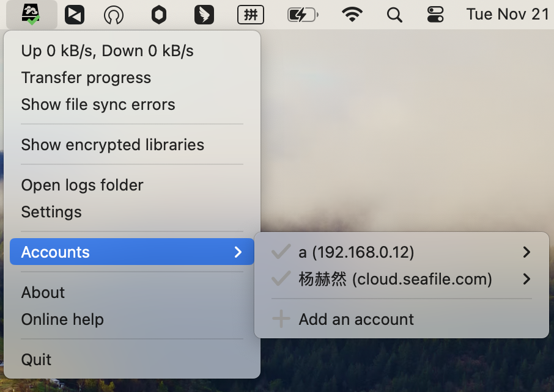
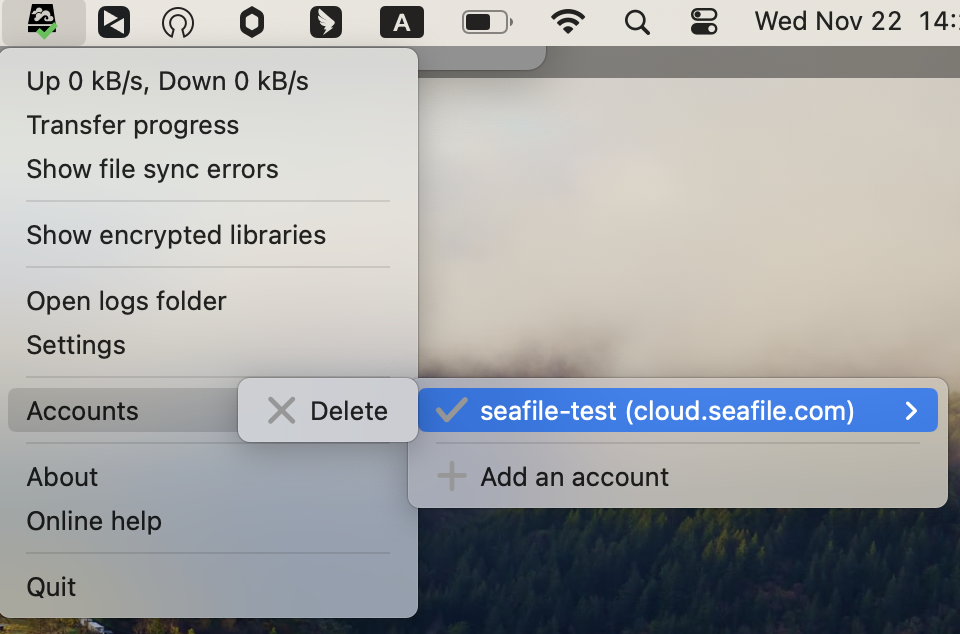

# SeaDrive for macOS and later versions

If you are using macOS 12.1 or later versions, then you can download SeaDrive 3.0.

Please download SeaDrive 2.0 if your macOS is below 12.1. All SeaDrive clients require macOS 10.14 or higher to install and run.

SeaDrive 3.0 use File Provider API to implement SeaDrive File Provider extension, which is redesigned with deeper integration to macOS. We recommend macOS users to upgrade to SeaDrive 3.0 for more native virtual drive experience.

## Install and Access the Virtual Drive

You can download SeaDrive 3.0 from [official Seafile website](https://www.seafile.com/en/download/). After installation and logging into your Seafile account, SeaDrive creates a SeaDrive entry in the Finder. Upon clicking the entry, SeaDrive promptly presents the categorized folder, making it ready for use.

## Accessing Files in the Virtual Drive

Libraries are grouped into 4 categories in the virtual drive: My Libraries, Shared with me, Shared with groups and Shared with all.

Files in the virtual drive are created as "placeholders" in the local file system. They may be in 2 states:

* **Placeholder file**: An empty representation of the file and can only be opened when there is network connection.
* **Full file**: The file has been downloaded and saved locally. Download is automatic when a placeholder file is opened for the first time. These files are available whenever you open SeaDrive regardless to network connections. The operating system may decide to clear a full file when more disk space is needed.

You can control which files or folder are cached locally. Choose "Remove Download" when you want to clean the cache for a file or folder.

In SeaDrive 3.0, full files are automatically kept in sync with the server.

## File Download and Control

Whenever you open a placeholder file or click on the cloud icon on the file, the operating system will automatically start to download it. If the file may take some time to download, the cloud icon will change to a progress icon to show the download progress.

## Cache Management

You can set the cache size limit and clean interval in the settings.

When the cache size surpasses the limit, SeaDrive will automatically remove downlod by prioritizing files based on their last modification time. This process continues until the cache size is reduced to below 70% of the specified limit.

## Account Management

In SeaDrive 3.0, you can log into multiple accounts across different servers, providing access to files from all linked accounts within the Finder entry.

You can log out of the account by selecting 'Delete' in the account management, at this time it will log out of the account and keep the local files that have been cached.

## FAQ

### Can I create, delete, rename libraries?

Yes. When you create, delete or rename library folders in the virtual drive, the operation will be reflected on the server. You can only create, delete, rename libraries under the "My Libraries" category. Creating, deleting or renaming libraries in other categories will be ignored.

### Can I create files or folders outside of a library folder?

No. Files created outside of a library folder will be deleted and **NOT **synced to the server. A new folder under the "My Libraries" folder will be handled as a new library.

### Can I access encrypted libraries?

Yes. By default, encrypted libraries are not synced, but shown in the virtual drive. You need to manually choose which encrypted libraries to sync and enter the password. Just right click on the SeaDrive icon in the system tray area and choose "Show encrypted libraries". A window will show up and you can choose to sync or unsync an encrypted library.

### Is it compatible to SeaDrive 1.0 and SeaDrive 2.0?

SeaDrive 3.0 will use any existing accounts and their metadata (stored under ~/Library/Containers/com.seafile.seadrive.fprovider). But it will not use the cached files from SeaDrive 1.0 and SeaDrive 2.0. So any locally cached files in 1.0 version or 2.0 version will not be accessible in 3.0 version. You can start SeaDrive 1.0 or SeaDrive 2.0 again to upload the files to server or copy them out.

### How do I clean the cache?

You can manually choose which folders or files to be cached locally. If you find a folder consumes too much space, just choose to "Remove Download" on that folder and all cached files in that folder will be cleaned.
