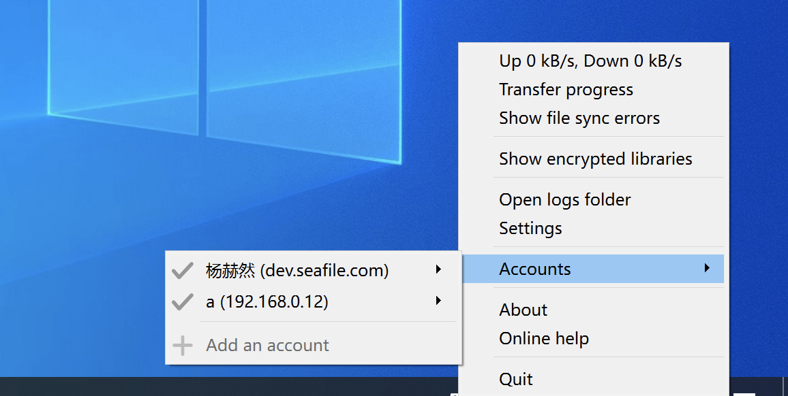
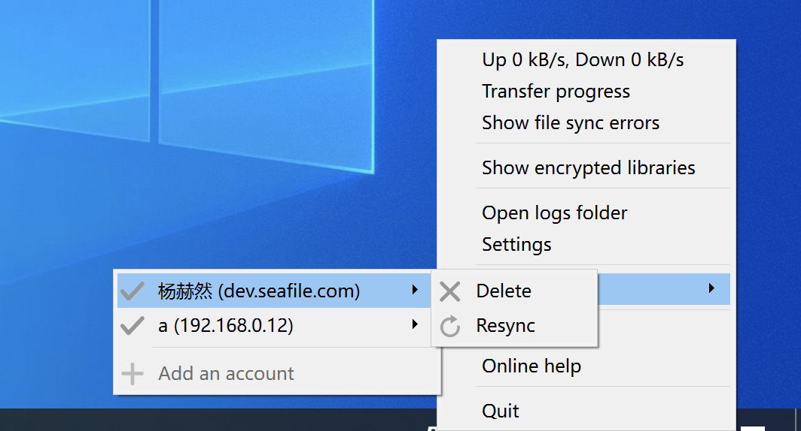

# SeaDrive for Windows 10 and later versions

If you are using windows 10 or later versions, it's recommended to use SeaDrive 3.0.

SeaDrive 3.0 (and future versions) is redesigned with deeper integration to Windows 10 operating system. It supports Windows 10 1709 version (2017 Fall Update for Windows 10) and later versions. We recommend Windows 10 users to upgrade to SeaDrive 3.0 for more native virtual drive experience.

## Install and Access the Virtual Drive

You can download SeaDrive 3.0 from [official Seafile website](https://www.seafile.com/en/download/). After installation and logging into your Seafile account, SeaDrive will start downloading library and file lists from the server (just as in SeaDrive 1.0.x). It may take some time, depending on the number of files available in your seafile account. The download is progressive, so in the mean time you can already access some files in the virtual drive.

To access the virtual drive, just open Windows file explorer. There is a "seadrive" node in the navigation pane of Windows file explorer.

## Accessing Files in the Virtual Drive

Libraries are grouped into 4 categories in the virtual drive: My Libraries, Shared with me, Shared with groups and Shared with all.

As you can see, the file status icons is more integrated into Windows file explorer. The icons are a bit different form version 1.0.

Files in the virtual drive are created as "placeholders" in the local file system. They may be in 3 states:

* **Placeholder file**: An empty representation of the file and can only be opened when there is network connection.
* **Full file**: The file has been downloaded and saved locally. Download is automatic when a placeholder file is opened for the first time. These files are available whenever you open SeaDrive regardless to network connections. The operating system may decide to clear a full file when more disk space is needed.
* **Pinned full file**: The file has been downloaded and saved locally. It is guaranteed to be available offline.

You can control which files or folder are cached locally. This can be changed from the context menu when you right click on a file or folder. Choose "Always keep on this device" when you want to pin a file or folder locally; choose "Free up space" when you want to clean the cache for a file or folder.

In SeaDrive 1.0, cached files are not automatically updated when they're updated on the server. In SeaDrive 3.0, full and pinned files are automatically kept in sync with the server.

## File Download and Control

Whenever you open a placeholder file, the operating system will automatically start to download it. If the file may take some time to download, there will be a progress bar shown up in file explorer and you may cancel the download.

Sometimes a background application may try to download a file in the virtual drive (such as an Anti-Virus software). You will be notified by the operating system about this and you may choose to cancel the download or disallow the application from automatically downloading files in the future.

## Cache Management

You can customize the cache directory and set the cache size limit and clean interval in the settings.

When the cache size exceeds the limit, SeaDrive will automatically free up space based on files' last modification time. Older files will be cleaned up first. This process continues until the cache size is reduced to below 70% of the specified limit.

## Account Management

In SeaDrive 3.0, you can log into multiple accounts across different servers, providing access to files from all linked accounts within the cache directory.

You can log out of the account by selecting 'Delete' in the account management, at this time it will log out of the account and keep the local files that have been cached. 

Some special sync errors, such as invalid placeholders, local metadata corruption, can be fixed by re-syncing the account.

## FAQ

### Can I create, delete, rename libraries?

Yes. When you create, delete or rename library folders in the virtual drive, the operation will be reflected on the server. You can only create, delete, rename libraries under the "My Libraries" category. Creating, deleting or renaming libraries in other categories will be ignored.

### Can I create files or folders outside of a library folder?

Yes. But files created outside of a library folder will be ignored and **NOT **synced to the server. A new folder under the "My Libraries" folder will be handled as a new library.

### Can I access encrypted libraries?

Yes. By default, encrypted libraries are not synced and shown in the virtual drive. You need to manually choose which encrypted libraries to sync and enter the password. Just right click on the SeaDrive icon in the system tray area and choose "Show encrypted libraries". A window will show up and you can choose to sync or unsync an encrypted library.

### Is it compatible to SeaDrive 1.0?

SeaDrive 3.0 will use any existing accounts and their metadata (stored under C:\\users\\username\\seadrive\\ folder). But it will not use the cached files from SeaDrive 1.0. So any locally cached files in 1.0 version will not be accessible in 3.0 version. You can start SeaDrive 1.0 again to upload the files to server or copy them out.

### Is it compatible to SeaDrive 2.0?

Yes. SeaDrive 3.0 is fully compatible to SeaDrive 2.0.

### How do I clean the cache?

Since seadrive will automatically free up space when the cache size exceeds the limit, you don't need to clean the cache. You can also choose to "Free up space" on a folder or a flie and the cached files will be cleaned.

### How to remove left-over SeaDrive shortcuts in Windows Explorer?

In general, when an account is deleted, the left-over SeaDrive shortcut associated with the account is also deleted.

In some corner cases, the "SeaDrvie" shortcut will be left-over in Windows Explorer and you want to remove it.

You can usually remove those shortcuts by uninstalling SeaDrive program and choose "Remove account information" in the prompt dialog.

If uninstallation doesn't remove the shortcuts successfully, you can remove the SeaDrive shortcut in Windows Explorer by editing the registry. Open the path "HKCU\\Software\\Microsoft\\Windows\\CurrentVersion\\Explorer\\Desktop\\NameSpace\\" in registry editor. Remove the sub-keys correspond to the shortcut you want to remove.
