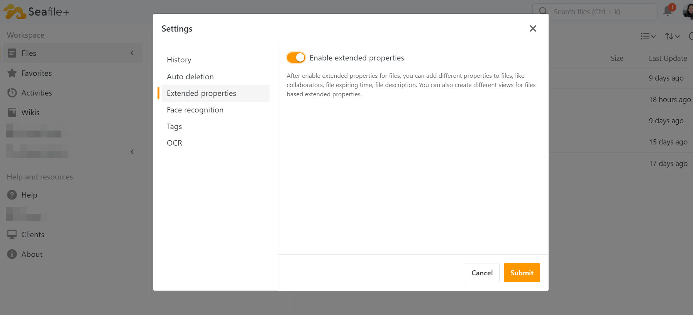

# Enable the Metadata Function

## **Turn on the Metadata Feature**

To configure the metadata settings, click on the location indicated by the arrow in the following image.  

In the Settings menu, look for the Extended Properties section.

Toggle the Enable extended properties option to activate this feature.

Once enabled, you will be able to add various metadata to your files.

The Extended Properties feature in Seafile greatly enhances the way files are managed by allowing users to attach meaningful metadata.  This capability not only improves file organization but also facilitates better collaboration among team members.
