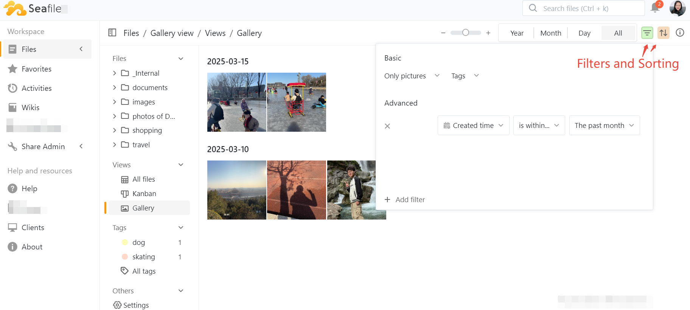
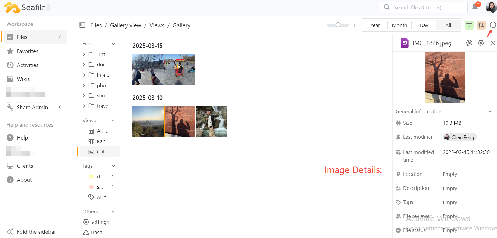

# Gallery View

The Gallery view in Seafile presents files in the form of thumbnails, making it ideal for viewing images and videos.

## **Create Gallery View**

To create a new Gallery view, click the plus icon (+) on the right side of the view, and you can choose to create a new Gallery view.

## **Key Features**

### Viewing Images

Thumbnail Display: Images are shown as thumbnails in a grid layout, allowing for easy browsing.  You can click on any thumbnail to enlarge the image for a better view.

Date Grouping: It automatically classifies pictures by year, month, and date.

Filters and Sorting: Use available filters and sorting options for an organized view of the image.

Image Details: Clicking on a thumbnail opens a sidebar with detailed information, including size, modification time, and shooting information.

###  AI-Driven Features

The Gallery View offers an organized and visual interface for managing images.  

With AI-driven features, users can enhance their image management experience by automatically generating descriptions, extracting details, and creating smart tags.

