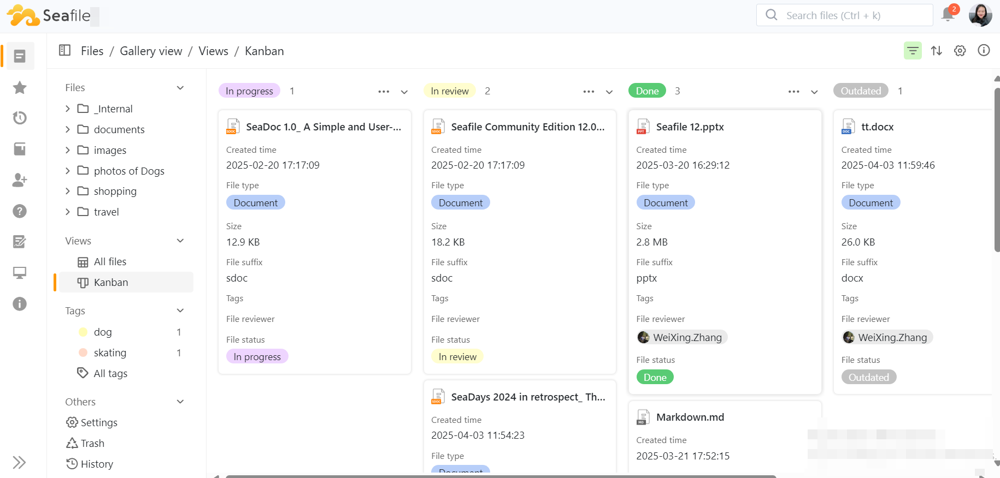

# Kanban View

The Kanban view in Seafile utilizes a card-based layout, ideal for task management and categorization.

Each file or project can be treated as a card, which can be organized into different columns based on various properties, such as file type.  

This layout provides a more intuitive experience compared to the table view.

It is extremely useful for visualizing workflows, tracking progress, and managing tasks related to files.

## **Create Kanban View**

To create a new Kanban view, you first need to turn on extensible properties.

Then click the plus icon (+) on the right side of the view, and you can choose to create a new kanban view.

## **Key Features**

### Settings

The Kanban view settings allow users to customize how their files are displayed and organized. 

The following options are available:

* Group by：Choose how to categorize files in the Kanban. The default setting is by File status. Options include: In Progress, In review, Done, Outdated.
* Title Property: Select the property to use as the title for each file/card in the Kanban view.  The default setting is File name.  This can be changed to other custom properties if required.
* Don't show empty values: Toggle this option to hide any cards that do not have associated data or values.
* Show property names: Toggle this setting to display or hide the property names on the cards, depending on your display preference.
* Text wraps: Enable this feature to allow text within the card to wrap, thus preventing overflow and enhancing readability.  When activated, longer titles will be displayed across multiple lines.
* Properties to display on the card: Customize which additional properties to show on each card within the Kanban view for better context on each file’s status.

## **Using the Kanban View**

Once the settings are configured, users can manage their tasks effectively:

Drag and Drop: Move files between different statuses by dragging and dropping cards from one group to another, facilitating an agile workflow.

Card Details: Click on a card to view more details about the file or to edit its content. Above the detailed information section, users can choose to generate a description or tags for the file through AI.

Filters and Sorting: Use available filters and sorting options for an organized view of the project components.

The Kanban view in Seafile is an intuitive and efficient tool for managing your projects.          

By configuring the settings to suit your workflow, you can optimize your project tracking and enhance collaboration within your team.   

