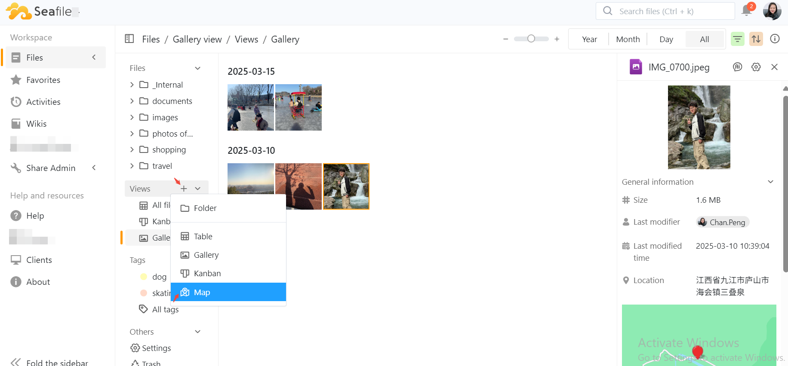

# Map View

The Map view in Seafile is specifically designed for visualizing geographical information, and it is applicable to image files.

## **Create Map View**

To create a new Map view, click the plus(+) icon on the right - hand side of the view.  

Then, select the option to create a new Map view.

## **Key Features**

### Map Switching

Toggle between regular map view and satellite imagery.  This allows users to choose their preferred way of viewing the geographic information.

### Image Preview

You can zoom in and out on the photos, download them, or view the original images.

You can also view the next photo.

After clicking "View Original Image", further operations can be carried out on the independent image viewing page.

### Zooming

Use the buttons in the lower - right corner of the map page to zoom in and out, get a closer look at specific areas or get a broader view of photo locations.

Pinch - to - zoom gestures on the touchpad can also be used to zoom in and out.

The Map View in Seafile is an innovative way to manage and visualize your images based on location.       

By leveraging geographical data, users can gain insights into their photo collections and enhance their file browsing experience.   

