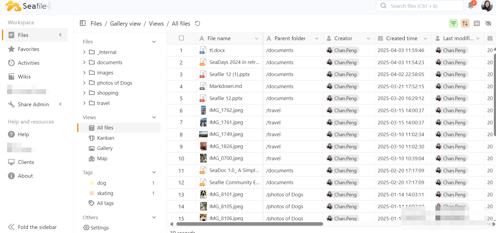

# Metadata Overview

Metadata refers to the supplementary information about files.  It serves as a powerful tool, enabling users to manage, search, and categorize files more efficiently.

For image files, metadata may include details such as the capture time, shooting device, geographical location.

In the case of document files, metadata typically contains information like the creator, modification time, and file type.

The metadata function empowers users to attach a wide range of properties to files.

Based on this, users can create different views tailored to their needs, enabling them to view, organize, and manipulate data in the most suitable way.

Seafile currently supports four views: table view, kanban view, map view, and gallery view.  

Each view has its unique characteristics and application scenarios to meet the requirements for presenting different types of data.

## **Overview of File Properties**

This section provides an overview of the file properties available in Seafile, which are categorized into two main types: System - Predefined properties and Custom properties.

### System - Predefined Properties

The System - Predefined file properties can be divided into two categories:

Inherent file properties, which cannot be deleted by users, including:

* File name

* Parent folder

* Creator，Last modifier

* Created time，Last modified time

* File type

* Size

* Tags

* Location (for photos and videos)

User - Adjustable properties that can be added or deleted as needed, including:

* File collaborators, File reviewer, File owner

* File expire time

* File status

* Capture time

* File rate

* Description

### Custom Properties

In addition to the System - Predefined properties mentioned above, Seafile supports the addition of custom properties.  These custom properties allow users to define the property name and type.  

The supported property types include:

* Text

* Long Text

* Number

* Collaborator

* Checkbox

* Date

* Single select

* Multiple select

* Rate
