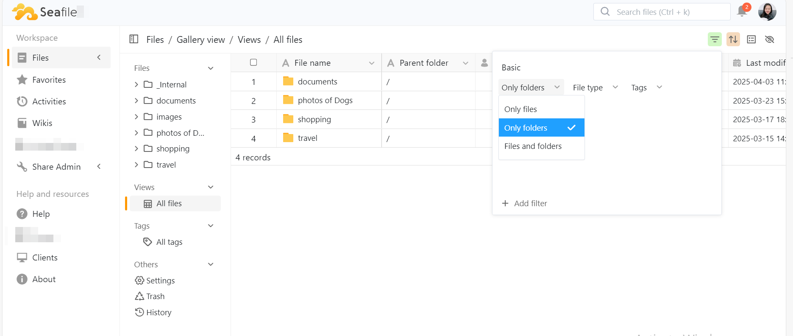
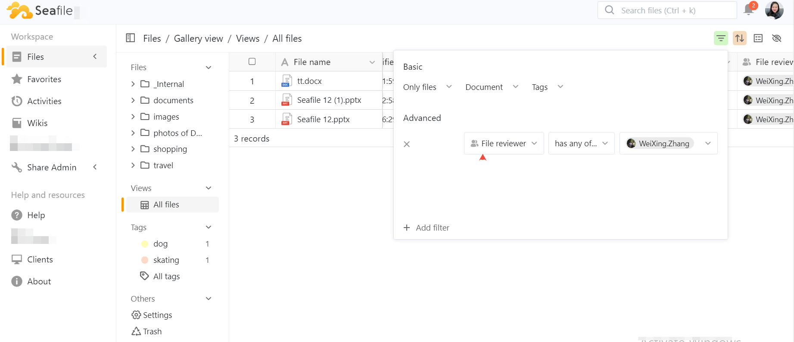

# Table View

The Table View displays all files in the library in a structured format, similar to a traditional spreadsheet.  

It displays key metadata for each file, such as file name, creator, created time, Last modifier, file type (e.g., image, document), and file size.

The Table View is highly suitable for scenarios where you need in - depth information about files.  It is especially beneficial when you plan to carry out filtering, sorting, and bulk management operations. 

## **Create Table View**

Once you enable the “Extended properties”, the Table View will become visible immediately.

### Key Features

#### Filtering Function

Users can filter the displayed files based on various criteria:

* Choose to display only files or folders.
* Select specific file types, including picture, document, videos, audio, code, compressed, and diagram.
* Filter files based on specific tags.

#### Advanced Filtering

The advanced filtering options allow users to precisely filter files based on the following properties:

General Properties: file name, parent folder, creator, last modifier, created time，last modified time, size, file suffix, description.

Media - Specific & Status Properties: capture time, file expire time, checkbox, number, multiple select, file collaborators, file reviewer, file owner, file status.

#### Sorting Function

Users can arrange files in ascending or descending order based on various properties.      

Such as: file name, creator, created time, last modifier, size, and file suffix.

#### Grouping Function

Files can be grouped for more intuitive management based on the following dimensions:

file type，file reviewer，file collaborators，file owner，file status

#### Customizing Visible Properties

Users have the flexibility to define which properties are visible in the table. 

Options include, but are not limited to, file name, parent folder, creator,  last modifier, created time，last modified time, and size.

#### Right - Click Menu Operations

In the Table View, users can perform quick operations on files via the right - click menu:

* Open file in a new tab
* Open parent folder
* Rename file
* Move file
* Delete file
* Extract file detail
* Generate description
* Generate file tags

The Table View in Seafile is an efficient way to organize, manage, and access your files with ease.  By utilizing the available features and actions, you can enhance your productivity and file management capabilities. 
