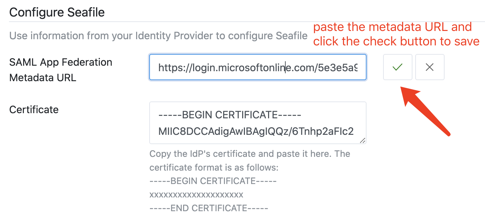
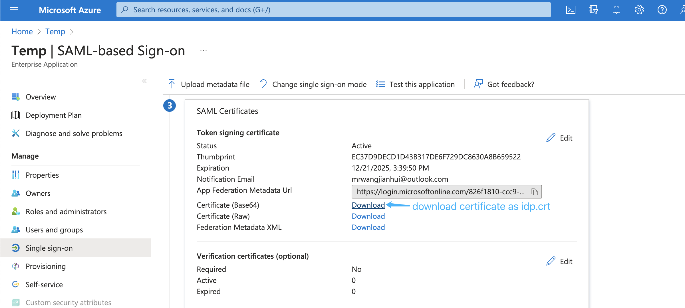
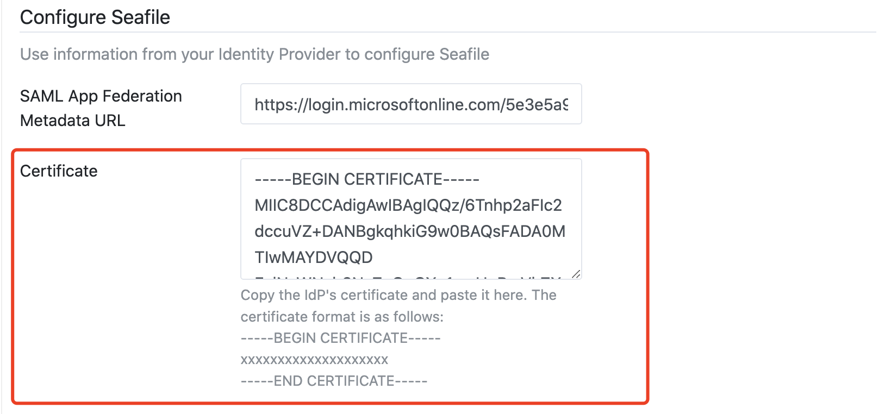
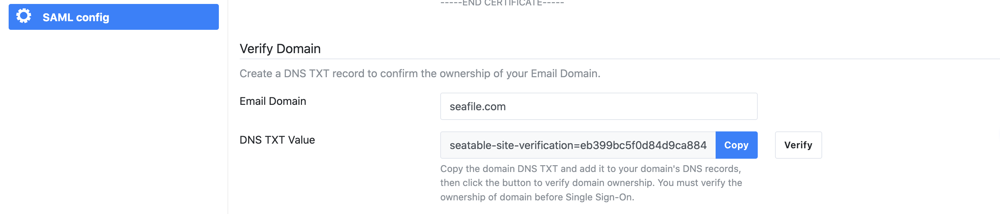
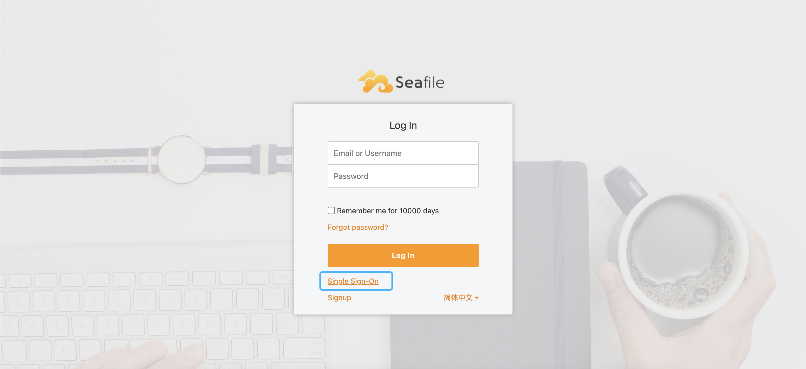
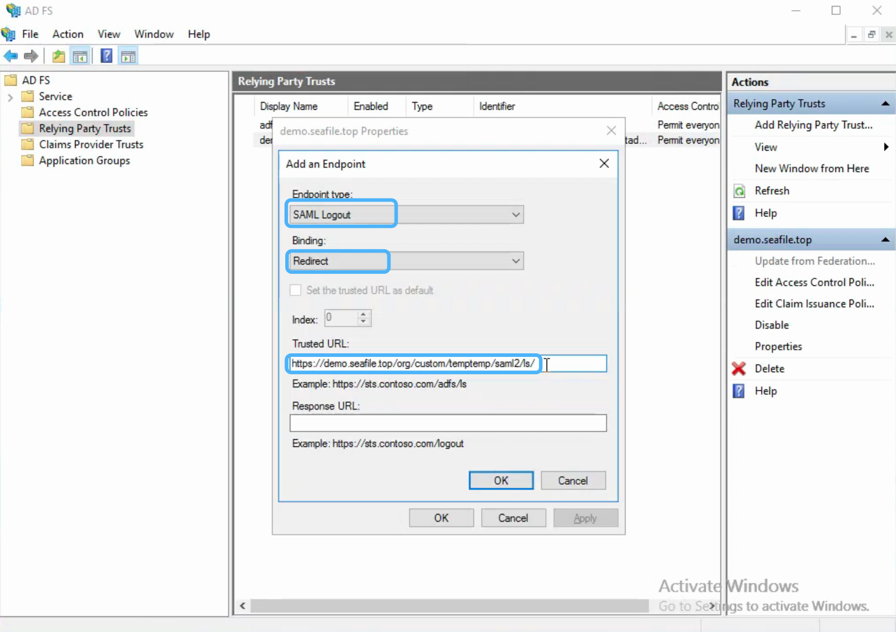

# Integration with ADFS/SAML single sign-on

**NOTE**: The following operations can only be performed by organization administrators.

The detailed steps depends on which ADFS service you use. We provide integration steps for Azure SAML SSO and on-premise ADFS.

## Integration with Microsoft Azure SAML single sign-on app

If you use Microsoft Azure SAML app to achieve single sign-on, please follow the steps below:

**First**, add SAML application and assign users, refer to: [add an Azure AD SAML application](https://docs.microsoft.com/en-us/azure/active-directory/manage-apps/add-application-portal), [create and assign users](https://docs.microsoft.com/en-us/azure/active-directory/manage-apps/add-application-portal-assign-users)

**Second**, setup your SAML infomations in the Seafile organization admin interface. 

**Then**, setup the _Identifier_, _Reply URL_, _Sign on URL_ and _Logout Url_ of the SAML app based by coping the specific URL to the SAML Configuration of your Idp in ADFS, refer to: [enable single sign on for saml application](https://learn.microsoft.com/en-us/azure/active-directory/manage-apps/add-application-portal-setup-sso). The format of the _Identifier_, _Reply URL_, and _Sign on URL_ are: https://example.com/org/custom/{org_id}/saml2/metadata/, https://example.com/org/custom/{org_id}/saml2/acs/, https://example.com/org/custom/{org_id}/, https://example.com/org/custom/{org_id}/ls/, e.g.:

__Note__: The {org_id} of the URL should be the ID of organization, and can only contain integer characters.

**Next**, copy the metadata URL of the SAML app:

and paste it into the organization admin interface, e.g:

**Next**, download the base64 format SAML app's certificate and rename to idp.crt:

 Open the idp.crt and copy the content to the organization admin interface:

**Next**, you can verify your domain by create a DNS TXT, and copy it to your domain's DNS records.

**Next**, [edit saml attributes & claims](https://learn.microsoft.com/en-us/azure/active-directory/develop/saml-claims-customization). Keep the default attributes & claims of SAML app unchanged, the _uid_ attribute must be added, the _mail_ and _name_ attributes are optional, e.g.:

**Finally**, open the browser and enter the Seafile login page, click `Single Sign-On`, e.g.

in the new page, enter your email address ending with the company domain name, e.g.

Click the `Log In` button will jump to the SAML app login page, e.g.:

## Integration with on-premise ADFS

If you use Microsoft ADFS to achieve single sign-on, please follow the steps below:

**First**, please make sure the following preparations are done:

1. A Windows Server with [ADFS](https://learn.microsoft.com/en-us/windows-server/identity/active-directory-federation-services) installed. For configuring and installing ADFS you can see [this article](https://learn.microsoft.com/en-us/windows-server/identity/ad-fs/deployment/deploying-a-federation-server-farm).

2. A valid SSL certificate for ADFS server, and here we use `temp.adfs.com` as the domain name example.

3. A valid SSL certificate for Seafile server, and here we use `demo.seafile.com` as the domain name example.

**Second**, setup your SAML infomations in the Seafile organization admin interface, and use these values to configure your identity Provider.

**Next**, setup the federation metadata URL of Microsoft ADFS in the organization admin interface. The format of the federation metadata URL is: `https://{your ADFS domain name}/federationmetadata/2007-06/federationmetadata.xml`, e.g:

**Next**, download the base64 format certificate and copy the content to the certificate field:

* Navigate to the _AD FS_ management window. In the left sidebar menu, navigate to **Services** > **Certificates**.

* Locate the _Token-signing_ certificate. Right-click the certificate and select **View Certificate**.

* In the dialog box, select the **Details** tab.

* Click **Copy to File**.

* In the _Certificate Export Wizard_ that opens, click **Next**.

* Select **Base-64 encoded X.509 (.CER)**, then click **Next**.

* Named it **idp.crt**, then click **Next**.

* Click **Finish** to complete the download.

* And then upload the idp.crt in the organization admin interface:

**Next**, add [relying party trust](https://learn.microsoft.com/en-us/windows-server/identity/ad-fs/operations/create-a-relying-party-trust#to-create-a-claims-aware-relying-party-trust-using-federation-metadata):

* Log into the ADFS server and open the ADFS management.

* Under **Actions**, click **Add Relying Party Trust**.

* On the Welcome page, choose **Claims aware** and click **Start**.

* Select **Import data about the relying party published online or on a local network**, type your organization metadate url in **Federation metadata address (host name or URL)**, and then click **Next**. Your organization metadate url format is: `https://example.com/org/custom/{org_id}/saml2/metadata/`, e.g.:

* On the **Specify Display Name** page type a name in **Display name**, e.g. `Seafile`, under **Notes** type a description for this relying party trust, and then click **Next**.

* In the **Choose an access control policy** window, select **Permit everyone**, then click **Next**.

* Review your settings, then click **Next**.

* Click **Close**.

**Next**, create claims rules:

* Open the ADFS management, click **Relying Party Trusts**.

* Right-click your trust, and then click **Edit Claim Issuance Policy**.

* On the **Issuance Transform Rules** tab click **Add Rules**.

* Click the **Claim rule template** dropdown menu and select **Send LDAP Attributes as Claims**, and then click **Next**.

* In the **Claim rule name** field, type the display name for this rule, such as **Seafile Claim rule**. Click the **Attribute store** dropdown menu and select **Active Directory**. In the **LDAP Attribute** column, click the dropdown menu and select **User-Principal-Name**. In the **Outgoing Claim Type** column, click the dropdown menu and select **UPN**. And then click **Finish**.

* Click **Add Rule** again.

* Click the **Claim rule template** dropdown menu and select **Transform an Incoming Claim**, and then click **Next**.

* In the **Claim rule name** field, type the display name for this rule, such as **UPN to Name ID**. Click the **Incoming claim type** dropdown menu and select **UPN**(It must match the **Outgoing Claim Type** in rule `Seafile Claim rule`). Click the **Outgoing claim type** dropdown menu and select **Name ID**. Click the **Outgoing name ID format** dropdown menu and select **Email**. And then click **Finish**.

* Click **OK** to add both new rules.

__Note__: When creating claims rule, you can also select other LDAP Attributes, such as E-Mail-Addresses, depending on your ADFS service.

**Next**, configure the logout page, e.g.:

The format of the logout URL is: `https://example.com/org/custom/{org_id}/saml2/ls/`, e.g.:

**Finally**, open the browser and enter the Seafile login page, click `Single Sign-On`. In the new page, enter your email address ending with the company domain name, click the `Log In` button will jump to the ADFS login page.
