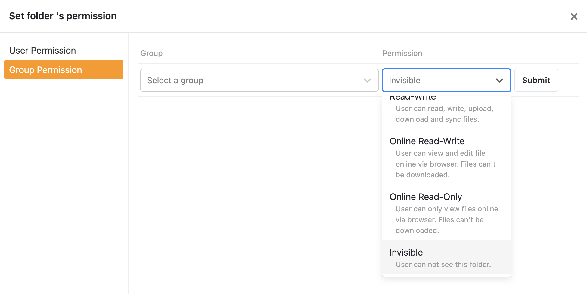

# Use Folder Permission for Fine-grained Access Control

For shared libraries or folders, you can set permission to its sub-folders for a person or a group. Available permissions are the same as the ones described in [sharing libraries](./sharing_files_and_folders.md). A special "invisible" permission is added in version 11 Pro Edition. Here are some use cases:

* You shared a library to a group with "read only" permission. You also want to allow a specific member of the group to modify files in one sub-folder. You can grant write permission of this sub-folder to this person.
* You shared a library to 3 groups. There are 3 sub-folders under that library, one for each group to upload files. However you don't want users to change files not belong to his/her group. You can grant write permission of a sub-folder only to its group.

Folder permissions are only effective for libraries and folders you share to others. To effectively set folder permissions to its sub-folders, you should first share the parent library or folder; otherwise the folder permission won't take effect.

One important design goal of folder permission is to support hierarchical permissions:

* Sub-folders automatically inherit folder permissions from its parent folder.
* Permissions set on sub-folders overwrites permissions set on its parent folder. For example, you set "read write" permission on folder "meeting files" for user A, and you set "read only" permission on sub-folder "meeting files/today" for user A. Then user A's permission to "meeting files/today" is "read only".

## Basic Usage

Only library's owner can set folder permissions for its sub-folders. In the file browsing interface, click "more operations" button, choose "permission" in the drop-down menu. In the pop-up window, you can see and set folder permissions on this folder.

If you want to see all folder permissions set in a library, hover the mouse on the library. Click "more operations" button, choose "Folder Permission" in the drop-down menu. In the pop-up window, you can see and set folder permissions in this library.

When other users navigate into a folder, there will be a small "eye" icon next to "read only" sub-folders. When the user navigate into that sub-folder, he/she won't be able to add/modify/delete files.

If a "read only" folder is synced to PC with the Seafile desktop App, changes under a "read only" folder won't be uploaded to the cloud.

## Advanced: Priority between Different Permissions

* Folder permissions have higher priority than the permission set in share. For example, if you share a library to user A with "read write" permission, and also set "read only" permission to a sub-folder of that library. Then user A only has "read only" access to the sub-folder, while he/she has "read write" access to all other sub-folders and files.
* Folder permissions set to a specific user have higher priority than permissions set to a group. That is, when checking permission for a folder, if the system matches a permission specific to the user, it'll ignore all permissions set for the groups the user belongs to.
* Permissions on sub-folders have higher priority than those on parent folders.

Here is a more complex example:

Supposed the folder structure looks like "A/B", user "John" is in group "Staff". If you set "read only" permission on folder A for John, and, you also set "read write" permission on folder "A/B" for group "Staff". Then John's permission to folder "A/B" is still only "read only". That's because, according to rule 2, "read only" permission is first matched for folder "A/B" and user "John", which is inherited from its parent "A".

## Invisible Permissions for Sub-folders

Sometimes you may want to share a folder to a group of users, with some sub-folders only visible or invisible for specific users. In version 11 Pro Edition, we added "invisible" sub-folder permission to support this use case.

To set invisible sub-folder permissions, just open the folder permission dialog as described this previous sections. You can then choose "Invisible" permission from the drop-down menu.

Suppose that you share a folder to a group of users, which includes user James. The folder you share contains 3 sub-folders: A, B and C. Let's go through two typical use cases for invisible folder permissions.

In the first case, you only want James to see folder B, the other users in the group should not see folder B. You can simply setup the folder permission like the following:

1. Set sub-folder B invisible for the group.
2. Set sub-folder B read-write for James.

This way the permission for James will overwrite the permission set to the group, making B only visible for James.

In the second case, you don't want James to see folder B. The solution is simple: you just set sub-folder invisible for James.

## Folder Permissions and File Syncing

Folder permissions have the below effects to file syncing:

* If you set read-write or read-only folder permissions for a sub-folder in a shared library or shared folder, the files in the library/folder can be synced with Seafile client and SeaDrive client.
* If you set online-read-write or online-read-only folder permissions for a sub-folder in a shared library or shared folder, the files in the library/folder can **NOT** be synced with Seafile client. SeaDrive client support syncing libraries with online-only sub-folders since version 3.0.10. The online-only sub-folders will not be created locally.
* If you set invisible folder permissions for a sub-folder in a shared library or shared folder, the library/folder can be synced with SeaDrive client. The invisible sub-folder will not be created locally.
* Seafile client cannot sync a shared library/folder with invisible sub-folders.
