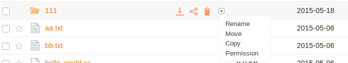
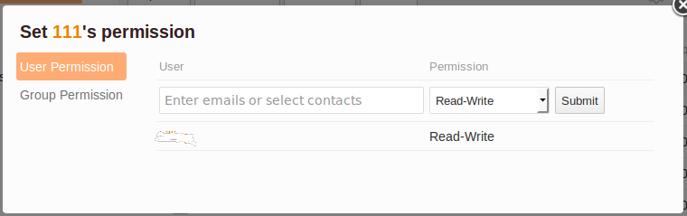
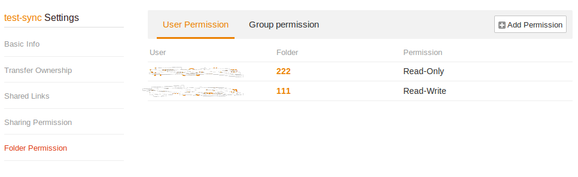

# How to Use Folder Permission for Fine-grained Access Control

Since Professional Edition 4.2.0, Seafile adds folder permission control feature. For shared libraries or folders, you can set permission ("read only" or "read write") to its sub-folders for a person or a group. Here are some use cases:

* You shared a library to a group with "read only" permission. You also want to allow a specific member of the group to modify files in one sub-folder. You can grant write permission of this sub-folder to this person.
* You shared a library to 3 groups. There are 3 sub-folders under that library, one for each group to upload files. However you don't want users to change files not belong to his/her group. You can grant write permission of a sub-folder only to its group.

Folder permissions are only effective for libraries and folders you share to others. To effectively set folder permissions to its sub-folders, you should first share the parent library or folder; otherwise the folder permission won't take effect.

One important design goal of folder permission is to support hierarchical permissions:

* Sub-folders automatically inherit folder permissions from its parent folder.
* Permissions set on sub-folders overwrites permissions set on its parent folder. For example, you set "read write" permission on folder "meeting files" for user A, and you set "read only" permission on sub-folder "meeting files/today" for user A. Then user A's permission to "meeting files/today" is "read only".

## Basic Usage

Only library's owner can set folder permissions for its sub-folders. In the file browsing interface, click "more operations" button, choose "permission" in the drop-down menu.

In the pop-up window, you can set permission for users and groups.

If you want to see all folder permissions in a library, open the "settings" page for the library and click "Folder Permission"

When other users view a folder, there will be a small "eye" icon next to "read only" sub-folders. When the user navigate into that sub-folder, he/she won't be able to add/modifiy/delete files.

If a "read only" folder is synced to PC with the Seafile desktop App, changes under a "read only" folder won't be uploaded to the cloud.

## Advanced: Priority between Different Permissions

1. Folder permissions have higher priority than the permission set in share. For example, if you shared a library to user A with "read write" permission, and also set "read only" permission to a sub-folder of that library. Then user A only has "read only" access to the sub-folder, while he/she has "read write" access to all other sub-folders and files.
2. Folder permissions set to specific user have higher priority than permissions set to a group. That is, when checking permission for a folder, if the system matches a permission specific to the user, it'll ignore all permissions set for the groups the user belongs to.
3. Permissions on sub-folders have higher priority than those on parent folders.

Here is a more complex example:

Supposed the folder structure looks like "A/B", User "John" is in group "Staff". If you set "read only" permission on folder A for John, and, you also set "read write" permission on folder "A/B" for group "Staff". Then John's permission to folder "A/B" is still only "read only". That's because, according to rule 2, "read only" permission is first matched for folder "A/B" and user "John", which is inherited from it's parent "A".
