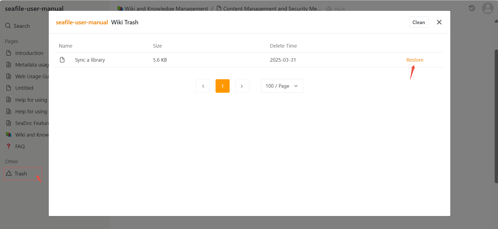

# Content Management and Security Mechanisms

The Wiki provides robust content management and protection features:

* **Trash Bin:** Deleted pages are temporarily stored in the trash bin, allowing users to restore accidentally deleted content and reducing the risk of data loss.

