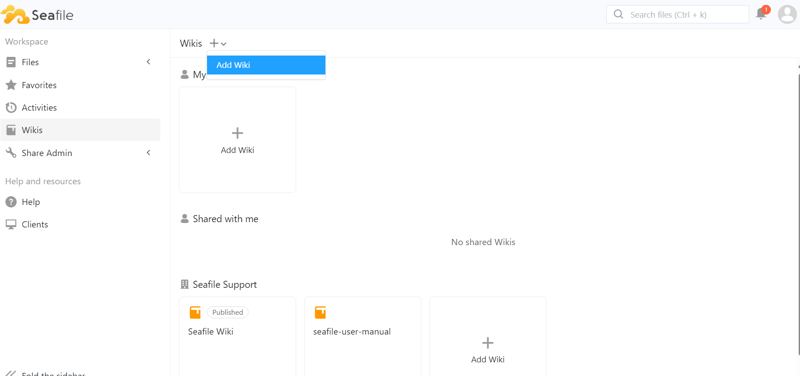

# Core Functions Overview

## Introduction
Seafile has introduced a dynamic Wiki feature built on the sdoc file format. This innovative Seafile Wiki provides users with an intuitive and efficient platform to manage their knowledge seamlessly. Additionally, it supports collaborative editing, making teamwork a breeze!

## Core Functions Overview
Wiki Knowledge base is an intuitive and flexible content management platform for team collaboration, knowledge base management, and personal note organisation. It is based on block editing, allows users to quickly build pages through drag-and-drop and modularity, and integrates a variety of useful features to optimise information organisation and navigation.

You can add a knowledge base by clicking the ‘Wikis’ option in the left navigation bar of Seafile.

