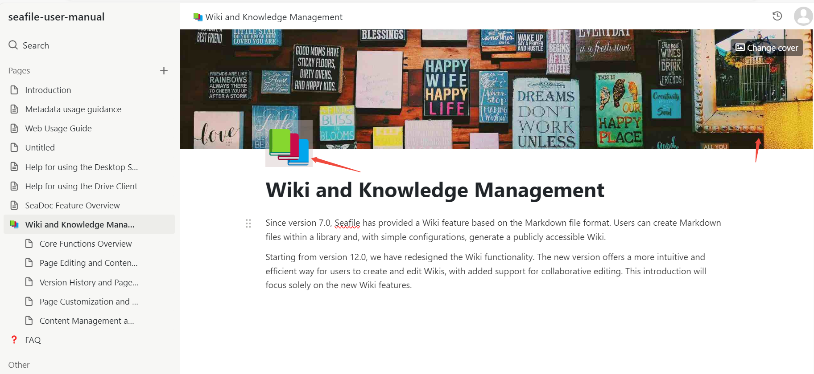
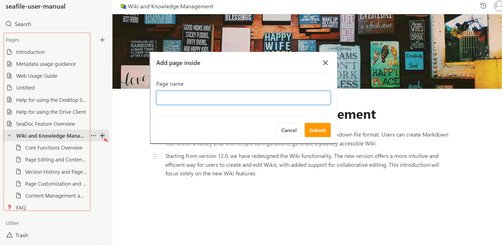
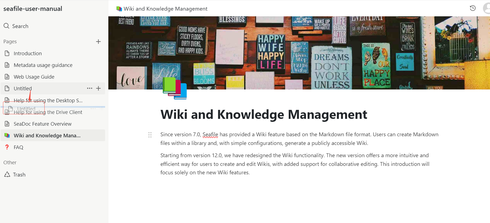
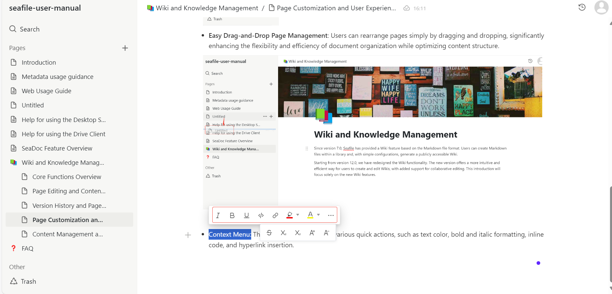

# Page Customization and User Experience Optimization

The Wiki offers a variety of page customization features:

* **Cover Images and Icons:** Users can add cover images and icons at the top of a page to enhance personalization and visual appeal.

* **Sidebar Navigation:** The left sidebar lists all pages for quick access. Users can also create subpages to improve navigation efficiency.

* **Easy Drag-and-Drop Page Management:** Users can rearrange pages simply by dragging and dropping, significantly enhancing the flexibility and efficiency of document organization while optimizing content structure.

* **Context Menu:** The context menu provides various quick actions, such as text color, bold and italic formatting, inline code, and hyperlink insertion.

