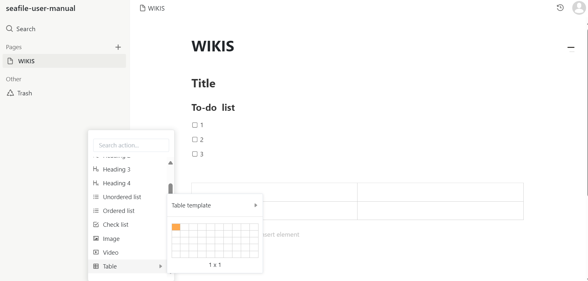
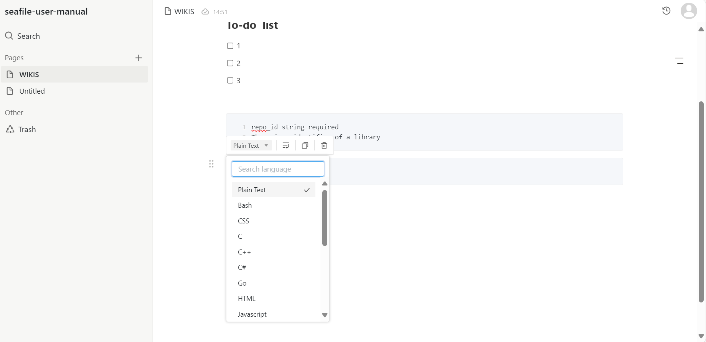
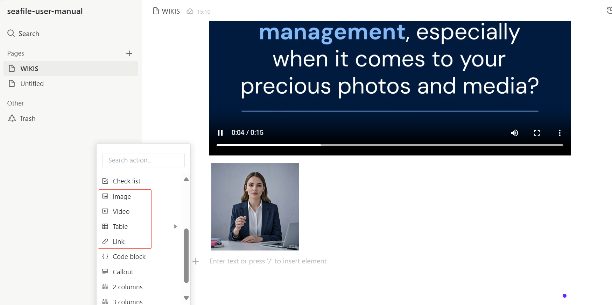
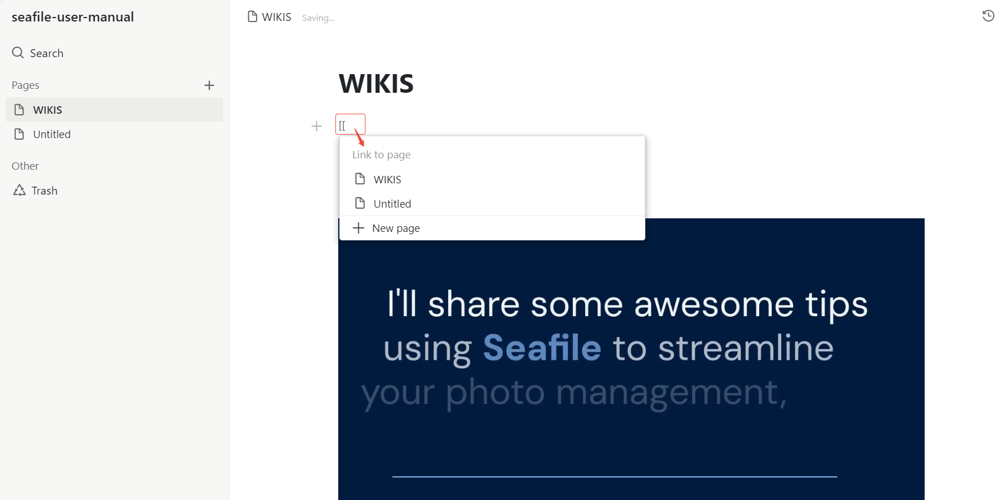

# Page Editing and Content Insertion

The Wiki allows users to quickly add various types of content by accessing the insertion menu through the left-side button or the "/" shortcut:

* **Headings, to-do lists, and tables can be easily inserted.**

* **Code blocks** support syntax highlighting for multiple programming languages, enhancing the documentation experience for developers.

* **Embedded media:** Images, videos, and hyperlinks can be seamlessly inserted to improve page presentation.

* **Internal references and links:** Use [[ to link to other pages, creating an interconnected knowledge network.

