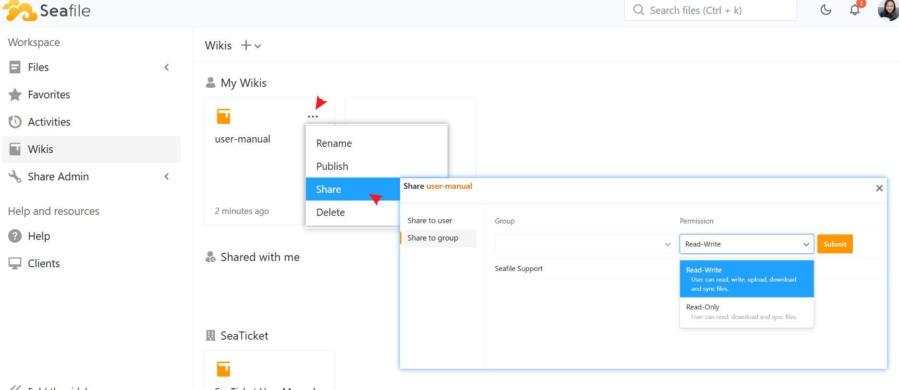
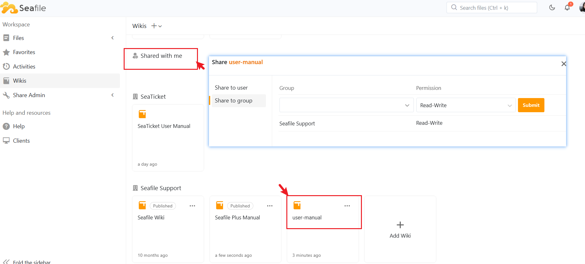
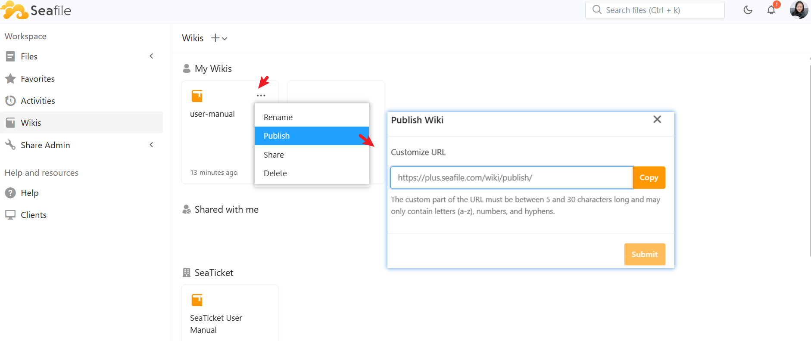

# Polish and Share Wiki

After creating your knowledge base, you can choose to share it with internal users or make it publicly accessible.

## Share Your Wiki (Internal Sharing)

Once you’ve built your knowledge base, you can easily share it with others within your organization

### Steps to Share a Wiki

In the left sidebar, navigate to the Wikis section.

1. Hover over the wiki you want to share.   
2. Click the more (⋯) menu and select the Share option.
3. In the sharing dialog, you can choose to share your wiki with Users/Groups

### Set Permissions

When sharing a wiki, you can set different permissions for each user or group:

* Read-Write Permission
Allows users to view, edit, upload, download, and sync files in the wiki.
* Read-Only Permission
Users can only view, download, and sync the content of the wiki. They can’t make changes.

Once you set the permissions, the users or group members will be able to view or edit the wiki based on the access you've granted.



## Where to View Shared Wikis

Users will find the shared wiki in the "Shared with Me" section or in their respective groups.



## Publish Your Wiki (Public Access)

Publishing your wiki makes it publicly accessible. External users or teams can view the content via a link, but they won’t be able to make any changes.

### Steps to Publish a Wiki

In the left sidebar, navigate to the Wikis section.

1.Hover over the wiki you want to publish.   
2.Click the more (⋯) menu and select the Publish option.
3.In the Publish dialog, you’ll be able to customize the URL for the published wiki.

### Customize the Public URL

The URL for your published wiki follows this format:

```
https://plus.seafile.com/wiki/publish/your-custom-name
```

The custom part of the URL must be between 5 and 30 characters long and may only contain letters (a-z), numbers, and hyphens.



### Sharing the Public Wiki

After publishing, you can copy the link and share it with external parties like clients, suppliers, or anyone who needs to access the wiki.

You can also embed the published link into a website or a page to allow external access.

The published wiki is read-only for external users. They can view the content, but they cannot make changes.
