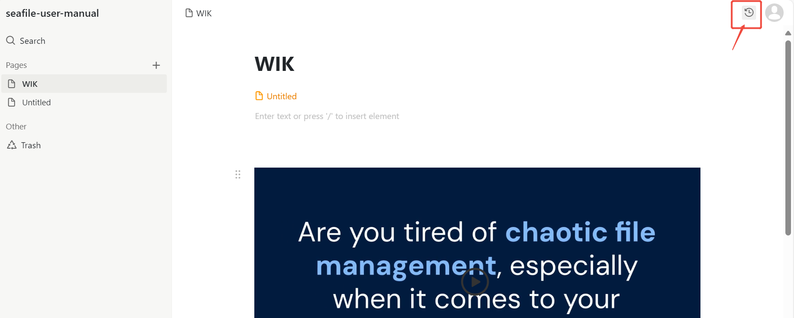
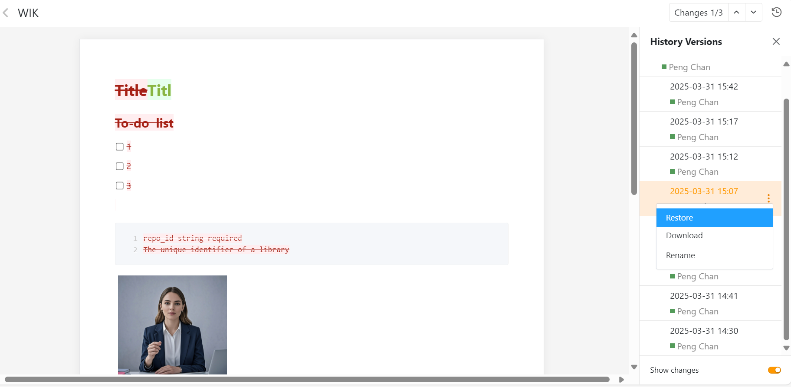
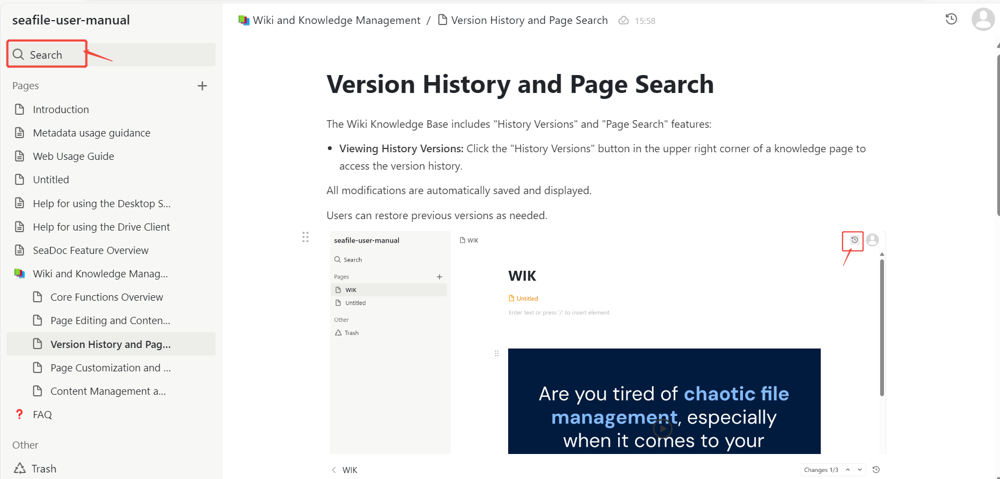
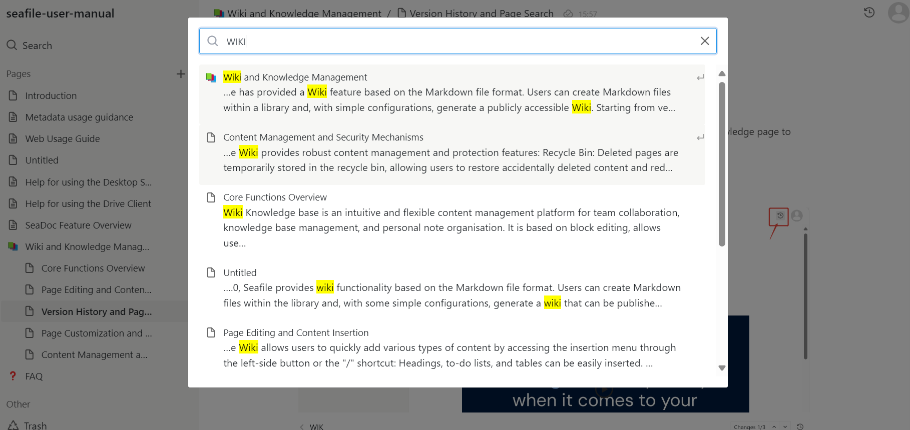

# Version History and Page Search

The Wiki Knowledge Base includes "History Versions" and "Page Search" features:

* **Viewing History Versions:** Click the "History Versions" button in the upper right corner of a knowledge page to access the version history.

    All modifications are automatically saved and displayed.

    Users can restore previous versions as needed.

* **Powerful Search Function:** Users can quickly locate documents and content within the knowledge base. By entering keywords in the search bar, the system instantly displays relevant pages, making it easy to find the necessary information.

    This feature is particularly useful for large knowledge bases with numerous documents, ensuring that users can efficiently rxQetrieve key information from vast amounts of data, ultimately improving productivity.

