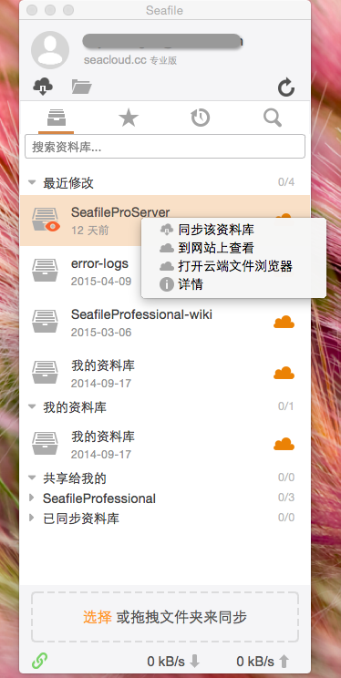
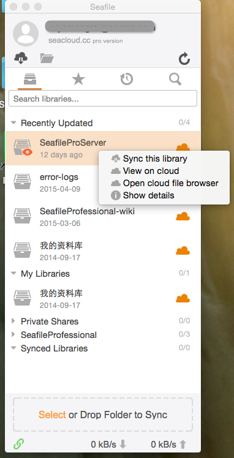
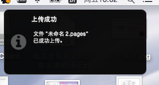
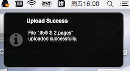
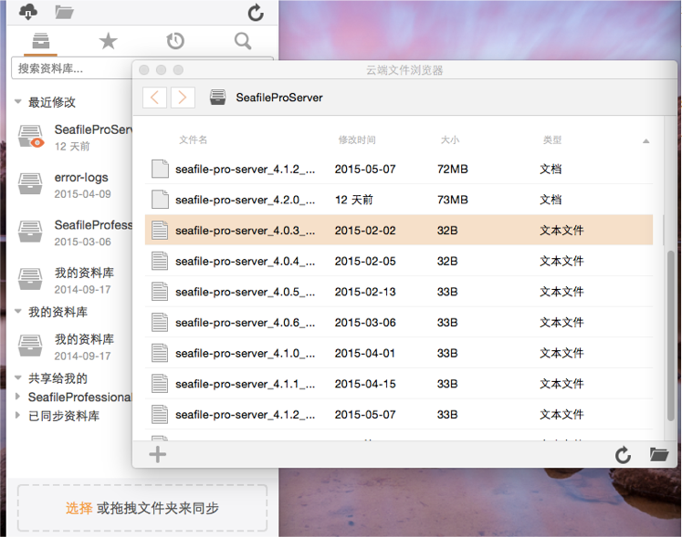
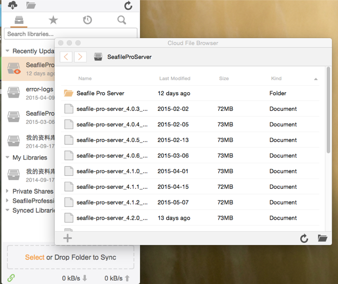
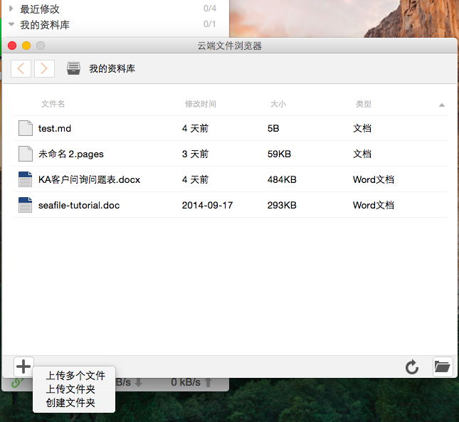
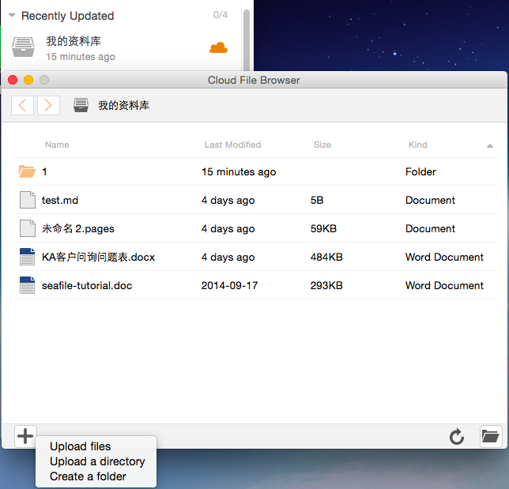
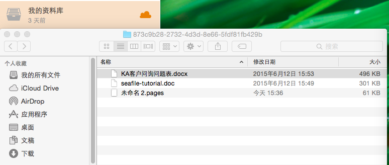
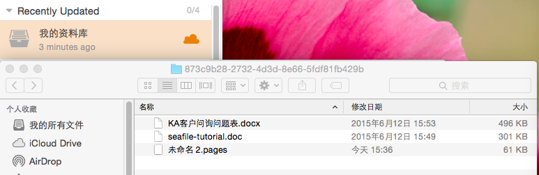

# 云端文件浏览器

### 通过云端文件浏览器来访问和编辑文件
有些资料库(比如文件较多,但是只是偶尔使用的资料库)您可能不想同步到本地后再使用，
Seafile提供了云端文件浏览器功能，方便您对未同步的资料库进行查看、编辑操作。
双击一个未同步的资料库，您就可以打开“云端文件浏览器”。
(或者右键点击一个资料库，在菜单中选择“打开云端文件浏览器”菜单项)

在云端文件浏览器中双击一个文件，该文件就会被下载下来并保存在本地缓存中。下载完成后，Seafile客户端会调用本地应用程序来打开该文件。此时您可以对文件进行编辑。编辑完成并保存后，Seafile客户端会自动将新的文件同步云端，同步后会出现上传成功提醒。

云端文件浏览器还支持对文件进行另存为、生成共享链接、重命名等操作。

### 上传文件和目录
云端文件浏览器提供两种方式供您上传文件：

#### 鼠标选取目标文件或文件夹，将其拖拽到“云端文件浏览器”框内，释放鼠标即可完成上传动作。

#### 点击“云端文件浏览器”左下角“＋”号按钮，可以看到自上而下“上传多个文件”“上传文件夹”“创建文件夹”三个菜单项。

上传多个文件允许您批量上传文件；
上传文件夹适用于您需要将文件夹整体上传至云端；
点击“创建文件夹”，给文件夹命名后，云端浏览器里生成新的文件夹，你可以添加文件到文件夹中。

### 管理本地缓存

通过云端浏览器打开的文件会缓存到本地文件夹中。点击界面右下角“打开本地文件夹”按钮，就可以进入本地缓存文件夹。在这里，您可以进行缓存文件删除，拷贝到缓存文件夹外等操作。

