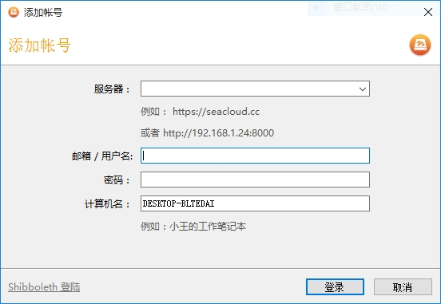
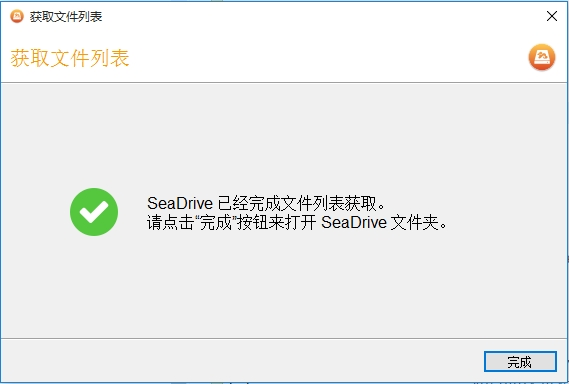

# 安装

在按照[下载页面](https://www.seafile.com/download/)上的说明下载安装了挂载盘客户端之后，你可以双击桌面上的 SeaDrive 图标来运行挂载盘客户端。

程序将会请你选择一个盘符。默认情况下会使用 "S:" 作为挂载盘的盘符。

然后程序将让你登录到服务器。

在登录成功之后,程序开始从服务器上获取你的资料库和文件列表。程序在此时不会下载文件的内容,因此这个过程一般会很快结束。你可以让文件列表下载在后台进行。当下载完成之后,程序会弹出提示。

