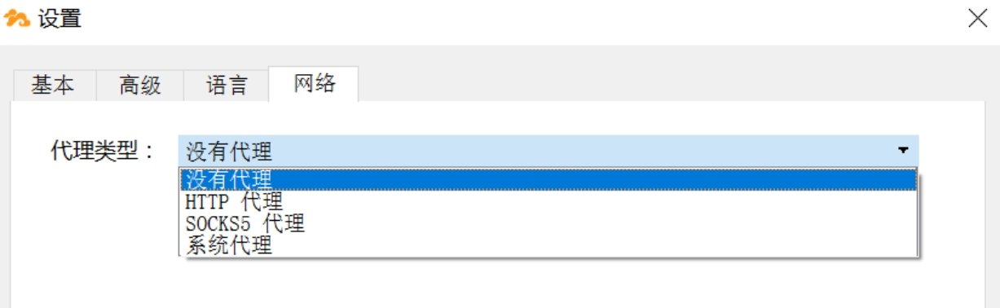
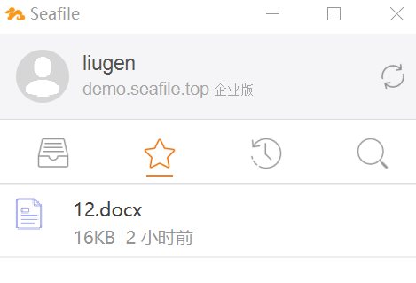
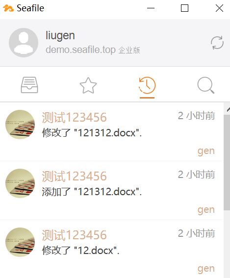
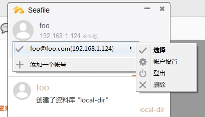
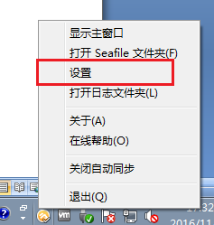
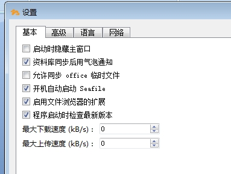

# 其他

## 代理设置

Seafile 客户端支持 3 种代理服务器:HTTP 代理、SOCKS5 代理和系统代理设置。

HTTP 代理和 SOCKS5 代理需要你输入代理服务器的地址和端口,如果你使用系统代理,Seafile 客户端将从操作系统中获取代理设置。操作系统有些机制可自动检测代理服务器的信息,因此你不需要手动输入代理服务器地址。

改变代理设置的步骤如下:右键点击系统通知区域中的“Seafile”图标,在菜单中选择“设置”。在弹出设置对话框中,您可以在“网络”选项卡中更改代理设置。

## 查看星标文件

在桌面客户端也可查看星标文件。

## 查看文件活动

在桌面客户端也可查看文件活动。

## 帐号管理

点击客户端界面上方头像,即可进行添加帐号,切换帐号,删除帐号,修改帐号对应的服务器地址等操作。

## 客户端设置

右键点击系统通知区域中的 Seafile 图标,点击“设置”,可对桌面客户端进行设置。

  
