# 同步资料库

## 同步远程资料库到本地

在客户端打开资料库列表,右键点击某一资料库,在弹出菜单中选择“同步该资料库”, 即可同步远程资料库到本地。

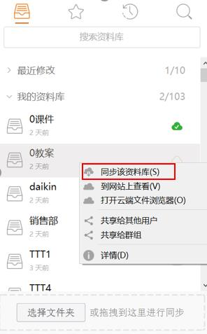

点击“同步该资料库”后有两种方式可以选择,第一种,你可以在弹框中选择一个目录, Seafile 将在这个目录下创建一个新的文件夹,这个文件夹的名字就是你将要同步的资料库的名称。

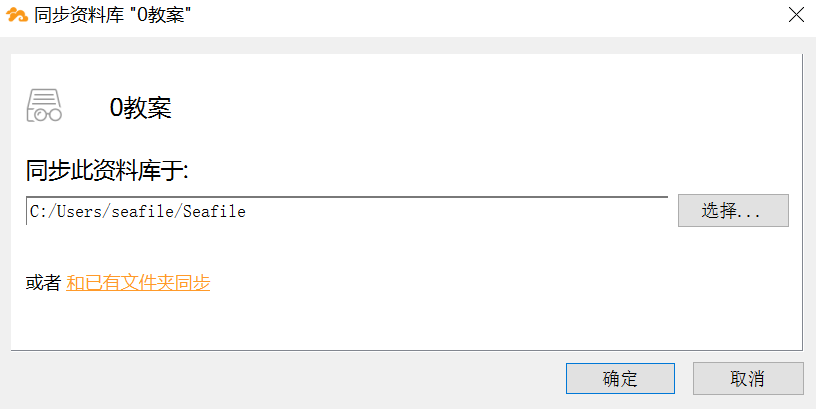

第二种,你可以将资料库同步到你本地的一个已经存在的文件夹。同步之后,本地文件夹和资料库中的文件将自动合并,本地文件夹和资料库中的文件不会被覆盖或者丢失。如果本地文件夹和资料库中,有文件名和文件格式都相同但是内容不同的文件,合并时将产生冲突文件。冲突文件的名称以作者的电子邮件地址和当前时间结尾,例如 test.txt(SFConflict name@example.com 2017-12-25-11-30-28)。

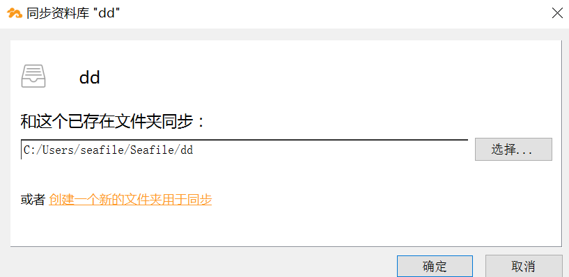

无论用哪种方式进行同步,点击“确定”之后,开始同步资料库。同步完成之后,资料库右边图标变为绿色,而未同步的资料库图标仍为橙色。

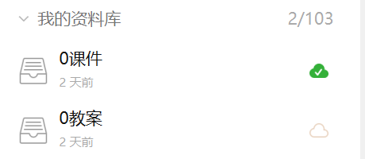

## 选择性同步子文件夹

你可能在服务器上有一些很大的资料库,但是你目前只对一个资料库的某个子文件夹感兴趣。你可以选择性地同步一个资料库中的一个子文件夹,而不是整个资料库。

操作如下图所示,双击一个未同步的资料库来打开云端文件浏览器,你将浏览到资料库内的文件和文件夹。右键点击资料库下的一个子文件夹,选择“同步该目录”即可完成该子文件夹的同步。在同步子文件夹之后,您可以在客户端主窗口的“已同步资料库”组 中查看其同步状态。

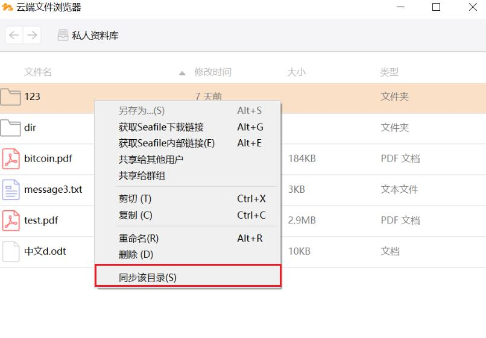

## 同步本地文件夹到远程服务器

你可以通过同步本地文件夹到 Seafile 服务器来创建一个资料库。

如下图所示,在 Seafile 同步客户端中,可以通过点击“选择文件夹”按钮在弹框中选择本地文件夹,或者拖拽本地文件夹到客户端界面两种方式来同步本地资料库到 Seafile 服务器。

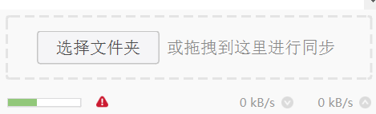

无论采用哪种方式,都可以看到“创建新资料库”弹框,“路径”代表你要同步的文件夹, “名字”代表同步到服务器的资料库名称,点击“确定”后,会在服务器中新建相应资料库并开始同步。

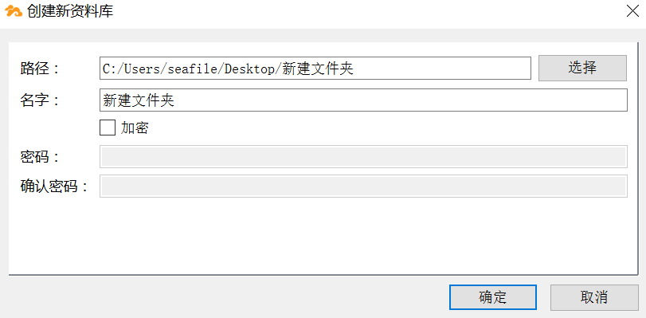

同步成功之后,在“我的资料库”列表里也会看到新同步的资料库。

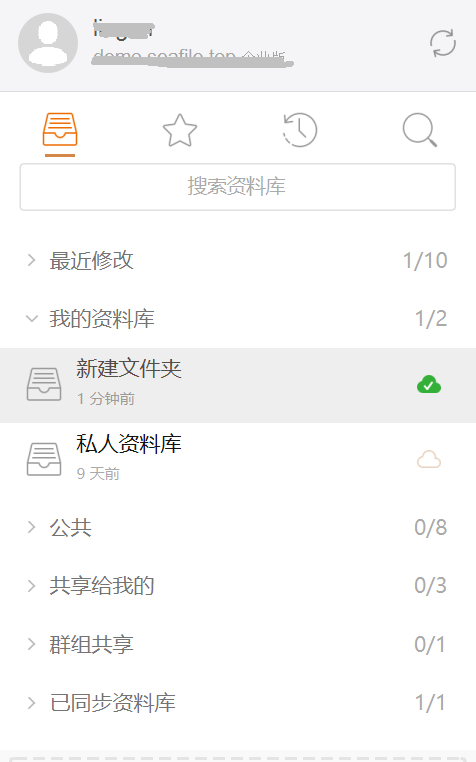

## 解除同步和重新同步

当你不想再让资料库和本地文件夹进行同步时,你可以对资料库解除同步。解除同步后,本地文件和文件夹的修改不再被上传到服务器上,资料库的修改也不再被下载到本地。如果想再次同步资料库和文件夹,你可以使用“和已有文件夹同步”功能(参考 2.1 的内容)。

有时,一些 Seafile 同步客户端的内部错误可能会影响资料库和本地文件夹的同步, 针对这种情况,通常可以“重新同步”一个资料库。”重新同步”时,Seafile 将提示你先解除同步,然后立刻对资料库和本地文件夹进行同步。

如下图所示,在 Seafile 同步客户端主窗口,右键点击一个已同步的资料库即可找到“解除同步”和“重新同步此资料库”功能。

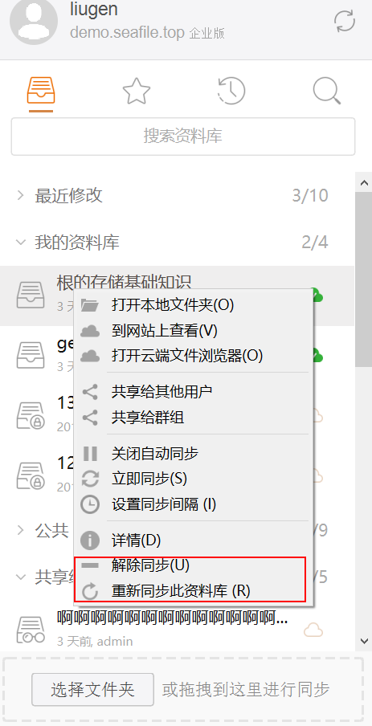

## 设置同步间隔

Seafile 同步客户端通常会自动检查本地文件夹的改动并将改动上传到服务器。但是, 如果本地文件夹位于 windows 网络共享驱动器中,Seafile 同步客户端不一定能可靠地检查出本地文件夹的改动。对于这种情况,你可以让 Seafile 周期性的去检查本地文件夹的改动。你可以设置周期同步的间隔,以秒为单位。

操作方法如下图所示:在 Seafile 同步客户端主窗口,选择一个已同步的资料库右键点击“设置同步间隔“,输入间隔时间,点击”ok”即设置完成。

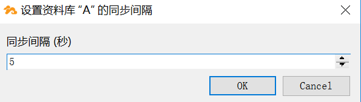

## 只读同步

对于只读的资料库或者文件夹, Seafile 将显示灰色的禁用图标()来表示它们是只读的。禁用图标如下图所示。

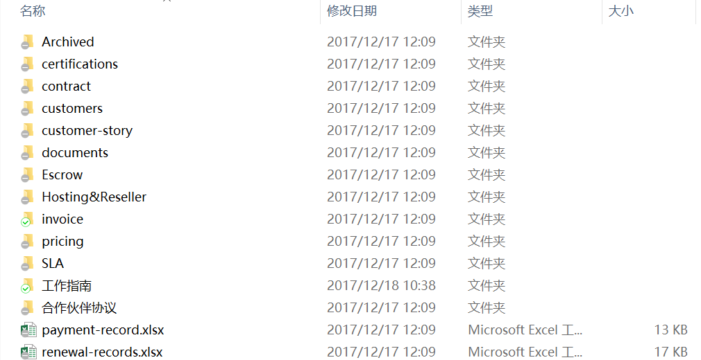

用户可以对同步到本地的只读文件夹中的某个文件进行修改,但是修改不会被同步到 Seafile 服务器。如果服务器端也对同一文件进行修改,客户端会提示本地文件和服务器端的同一文件产生冲突。修改的本地文件将会被重命名为一个“冲突文件”,服务器端的 文件将会被正常同步到本地文件夹中。

## 文件冲突

你和你的同事将一个共享的资料库同步到你们的电脑上,你们可以一起在资料库中添加,删除或者编辑文件。资料库中的所有修改都会自动同步到其他人的电脑上。

有时你和你的同事可能会同时编辑同一个文件,你们的修改可能会冲突。在这种情况下,Seafile 会将较先编辑完成的文件版本保存到服务器上,同时将另一个文件版本重命名为一个“冲突文件”。冲突文件的名称以作者的电子邮件地址和当前时间结尾,例如 test.txt(SFConflict name@example.com 2017-03-07-11-30-28)。

## 忽略部分文件/文件夹同步

有的时候你不想把一个资料库中的某些文件或者目录同步到服务器上。你可以通过在资料库的根目录中创建一个 seafile-ignore.txt 文件来让 Seafile 忽略这些文件或者目录。文件的每一行对应一个模式(pattern)。目前支持的模式格式如下:

1.  空行不匹配任何文件。
1.  以 # 开头的行是注释。
1.  支持通配符 \* 和 ?。比如,"foo/\*" 匹配 "foo/1" 和 "foo/hello";"foo/?" 匹配 "foo/1" 但是不匹配 "foo/hello"。通配符 \* 会递归匹配目录下的所有路径。比如 "foo/\*.html" 会匹配文件 "foo/a.html" 以及 "foo/templates/b.html"。
1.  如果一个模式以 "/" 结尾,那么它只会匹配目录,而不能匹配文件。比如,“foo/” 匹配目录 foo 以及它下面的所有文件,但是不会匹配文件 foo。
1.  如果一个模式不以 “/” 或者通配符结尾,那么它只能匹配文件,而不能匹配目录。

例子:

```
# a regular file
test-file

# a dir
test-dir/

# wildcard *
test-star1/*
test-star2/*.html

# wildcard ?
test-qu1/?.html
test-qu2/?/
```

seafile-ignore.txt 只能控制在客户端需要忽略哪些文件,这不会影响服务器的行为。你依然可以通过服务器的 web 界面创建这些被客户端忽略的文件。在这种情况下:

* 这些文件会被同步到客户端,但是用户在客户端对这些文件的后续修改会被忽略, 不会被同步回服务器。
* 文件在服务器端的后续更改会被同步到客户端,如果客户端也同时修改了这些文件,系统会生成冲突文件。

seafile-ignore.txt 只能忽略还没有被同步的文件。对于已经被同步的文件,如果后来把它添加到 seafile-ignore.txt 中,系统只会忽略后续更改,已经上传的版本不会受影响。