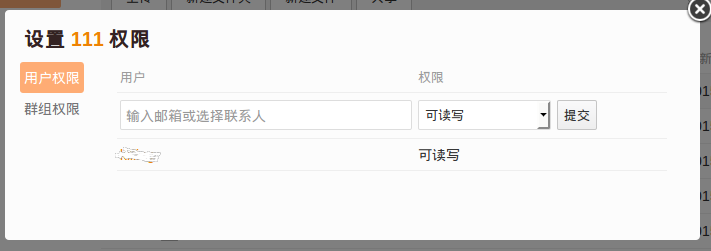
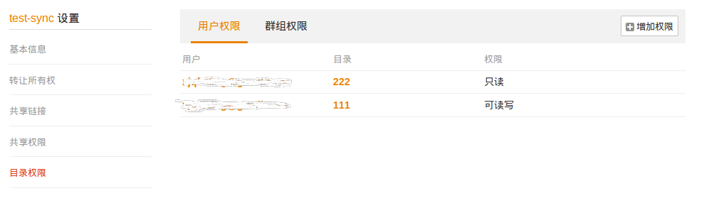

# 如何使用目录权限实现细粒度的访问控制

在 4.2 企业版中，Seafile 加入了对目录的访问权限设置。对共享出去的资料库或者目录，你可以针对某个用户或者群组，限定其对某些下面子目录的访问权限。以下是一些应用场景：

* 你把一个资料库只读共享给了一个群组，但是希望群组中某个人能修改一个子目录下面的文件。此时你可以单独给这个人设置写权限。
* 你把一个资料库只读共享给3个群组，资料库下面有3个目录，分别用于给每个群组的成员上传文件，但是你不希望用户修改其他群组里面的文件。此时你可以把这3个子目录分别给3个群组设置写权限。

目录权限只对共享出去的资料库或者目录有效。你首先需要将资料库或者目录共享给其他人，才能设定其他人对下面子目录的访问权限。否则设置的权限将不起作用。

目录权限主要针对企业中目录层级权限管理的需求而设计，

* 给一个目录设置的权限会自动被下面的子目录和文件继承。
* 在子目录上设置的权限覆盖父目录设置的权限。比如你在“会议文件”目录上给用户 A 设置了读写权限，又在子目录“会议文件/只读”上针对同一个用户设置了只读权限，最后用户 A 对“会议文件/只读”中的文件具有只读权限。

## 目录权限的基本用法

只有资料库的所有者可以设置下面目录的权限。在目录浏览页面中，点开“更多操作”菜单，从中选择“权限”操作。

此时会弹出一个小窗口，你可以在里面设置用户或者群组对这个目录的访问权限

如果你想查看在当前资料库中已经设置的目录权限，可以打开资料库的“设置”页面，点击“目录权限”

当被共享者查看一个目录时，如果改目录被设置了“只读”权限，在目录旁边会有一个小图标，进入该目录后，用户不能执行任何修改操作。

如果共享的资料库被同步到 PC 客户端，在 PC 上对只读的目录中文件的修改不会上传到服务器上。

## 高级：多种权限之间的优先级关系

1 目录权限优先于共享的时候设置的权限。比如读写共享一个资料库给用户 A，同时设置了下面一个子目录的只读权限，那么 A 对这个子目录的访问权限为“只读”。
2 针对特定用户设置的目录权限优先于对群组设置的目录权限。也就是说，当检查用户对某个目录的访问权限时，系统如果先匹配到一条针对用户设置的权限，就会忽略对用户所在群组设置的权限。
3 子目录上的权限优先于父目录上的权限。

例子：假如有两级目录 A/B，用户 U 属于群组 G，针对用户 U 和目录 A 设置了“只读”权限，同时，针对群组 G 和目录 B 设置了“读写”权限。那么当用户 U 访问目录 B 的时候，得到的最终权限是“只读”。这是因为根据规则 2，系统会优先匹配针对用户设置的权限，由于 B 自动继承了 A 上的权限，所以 U 对 B 的访问权限也是只读。
