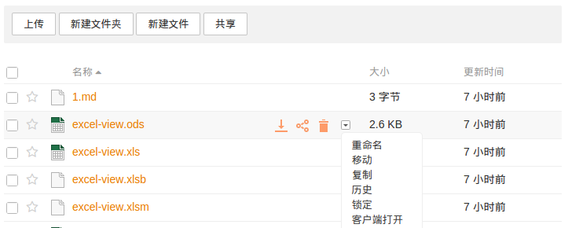
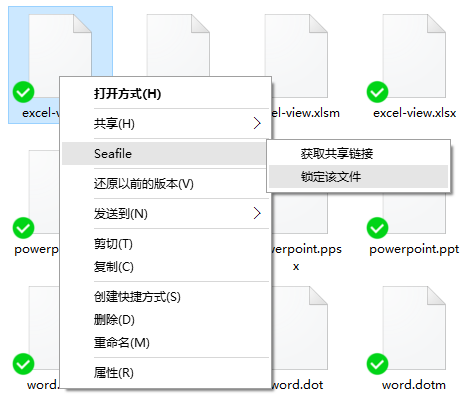
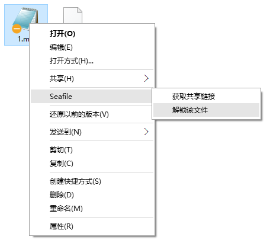
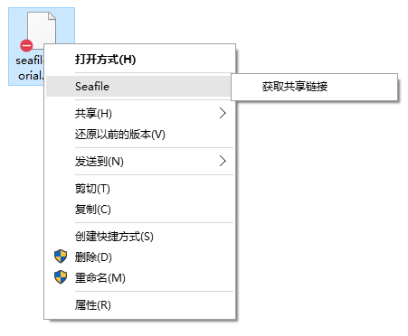

# 文件锁定

当有多个人同时围绕一个文件工作的时候，经常出现多人同时修改一个文件的情况。Seafile 通过生成冲突文件的方式来处理这种情况。但是，很多时候更为便捷的工作方式是当一个人修改文件的时候，先对该文件进行锁定，保证其他人不能同时修改。Seafile 企业版提供了文件锁定的功能。

您可以通过 Web 客户端和 PC 客户端来使用文件锁定的功能。我们将逐一介绍。

### Web 客户端

当您在 Web 界面中浏览一个资料库的时候，您可以通过点击文件旁边的“更多操作”菜单来找到文件锁定的按钮。

当文件被锁定之后，您可以看到在文件图标的右下角有一个红色的“停止”符号。当您把鼠标移动到这个符号上面时，可以看到是谁锁定了该文件。如果文件是由您锁定的，您可以解锁该文件。但是您不能解锁别人锁定的文件。

### PC 客户端

在一个资料库被同步到 PC 上之后，您可以直接在 Windows 文件管理器或者 Mac OS 的 Finder 里面直接锁定/解锁里面的文件。

您可以通过文件右键菜单锁定一个已同步的文件。

如果文件是由您本人锁定的，在文件左下角会显示一个橙色的“停止”符号。您可以通过右键菜单来解锁这个文件。

如果文件是由别人锁定的，文件右下角会显示一个红色的“停止”符号。该文件会自动变成只读状态，您不能修改它的内容。

如果一个资料库还没有被同步，您也可以通过 [云端文件浏览器](../desktop/file-cloud-browser.md) 来锁定或者解锁里面的文件。

### 关于文件锁定的更多信息

关于文件锁定功能还有几点额外的信息需要补充：

1. 被锁定的文件只能由锁定者来解锁。
1. 被锁定的文件只能被锁定者修改，但是其他用户依然可以删除、重命名或者移动该文件。文件锁定的目的只是防止文件被多人同时修改。
1. 当一个被锁定的文件被重命名或者在当前资料库内移动之后，它依然保持锁定状态。
