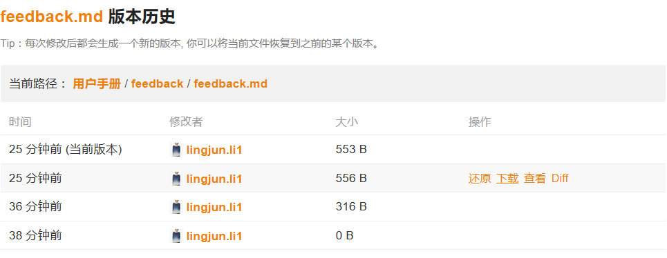
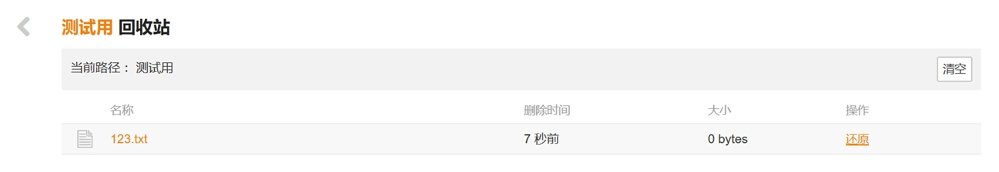

# 文件历史与回收站

## 管理文件版本

Seafile 记录所有文件的修改历史,每当一个文件被修改,就会生成一个新的版本。当你想访问一个文件之前的版本时,使用文件历史功能会很方便。

具体操作如下,进入某个文件夹,在文件所在行右侧倒三角图标的菜单中点击“历史”按钮,文件的修改历史将被列出。您可以下载、还原、查看文件的任意版本。对于文本文件,您还可以比较两个版本的内容。此外,您还可以通过设置资料库的历史保留期来配置文件版本的保留期。

## 恢复已删除的文件和文件夹

进入包含已删除文件或文件夹的资料库,点击操作栏中的“回收站”图标,删除的文件和文件夹将被列出,点击“操作”列的“还原”按钮,文件或文件夹将被还原到原来的路径下面。如果文件或者文件夹的父目录已经被删除,文件或者文件夹将被还原到资料库的根目录下。此外,您还可以通过设置资料库的历史保留期来配置已删除文件的保留期。

