# 文件管理

## 文件操作

点击一个资料库，进入目录页面后，即可进行上传，新建，共享等操作。

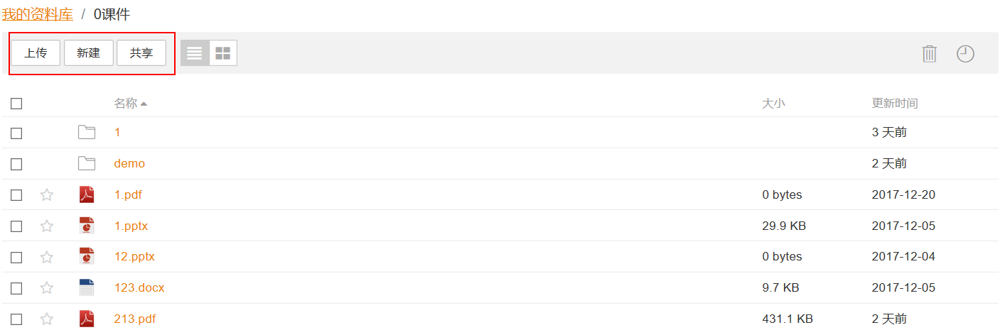

也可以通过文件或者目录右侧的操作按钮,单独操作某个目录或文件。

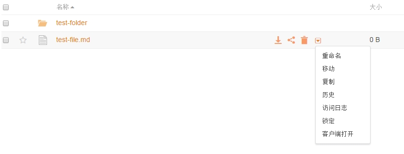

点击左边多选框,可以批量“移动”、“复制”、“删除”、“下载”选中的目录和文件。

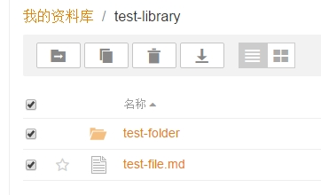

## 在线预览文件

Seafile 对部分类型的文件提供在线预览。当前支持的文件类型有: 微软 office 文件(.docx, .pptx,.xlsx, doc, ppt, xls)，Open Office 文件(.odt, .odp)，PDF 文件，文本文件 Markdown 文件，图片文件，音频文件，视频文件。

在目录查看页面，点击文件名称上的链接，即可进入文件查看页面，预览部分文件。

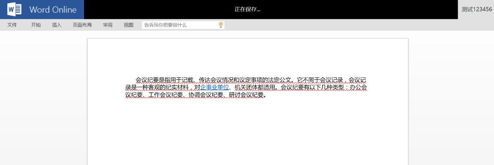

## 在线编辑文件

Seafile 对部分类型的文件提供在线编辑。当前支持的文件类型有：微软 office 文件(.docx, .pptx,.xlsx)，Open Office 文件(.odt, .odp)，文本文件，Markdown 文件。其中微软 office 和 OpenOffice 的在线编辑功能需要与第三方软件进行集成。

如果是 office 文件，在文件查看页面，可以直接对文件进行编辑。

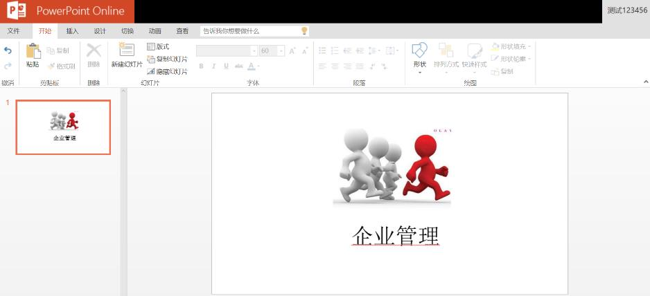
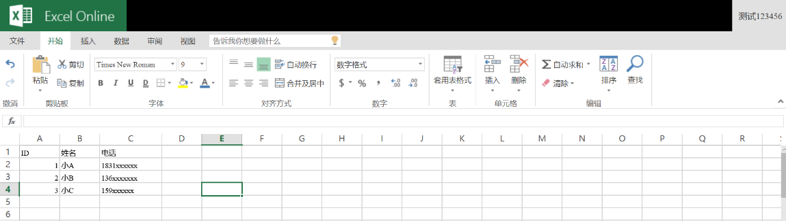

如果是文本文件或者 Markdown 文件，在文件查看页面，如图所示，点击铅笔形状的“编辑”按钮，进入编辑页面，编辑之后提交完成修改。

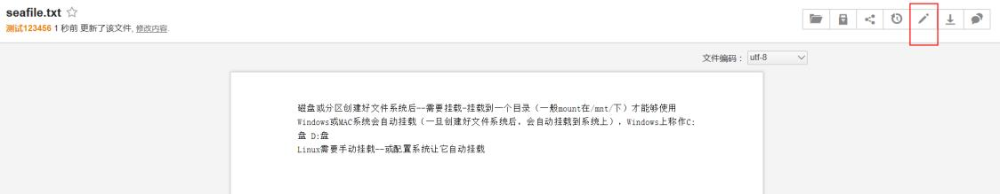
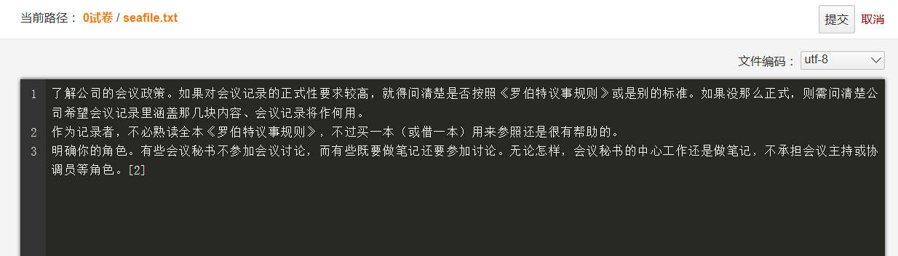

## 全文检索

如果您使用的是 Seafile 企业版，您可以在 Seafile 网页端搜索文件和文件夹名称，也可以搜索某些文件的内容。目前 Seafile 支持搜索内容的文件类型包括：微软 office 文件(.docx, .pptx,.xlsx, .doc, .ppt, .xls), LibreOffice 文件，PDF 文件，文本文件, Markdown 文件(.md)。

在 Seafile 网页界面上方检索栏中输入查询内容，点击“查询”按钮即可进行全文检索。可以在进入某个资料库后在资料库内部检索，也可以指定搜索的文件类型后进行检索。

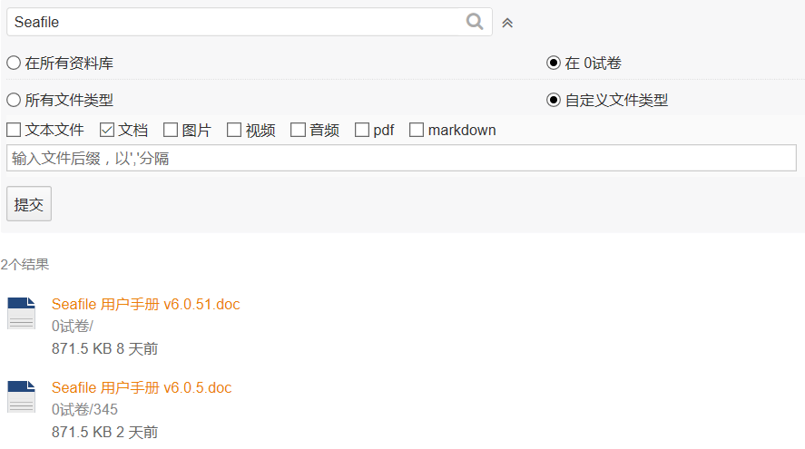

**注意**:您的 Seafile 系统管理员可能未启用全文搜索功能。在这种情况下,您只能搜索文件和文件夹名称。

## 收藏夹

点击左边功能导航栏“收藏夹”可查看星标文件,方便打开常用文件。

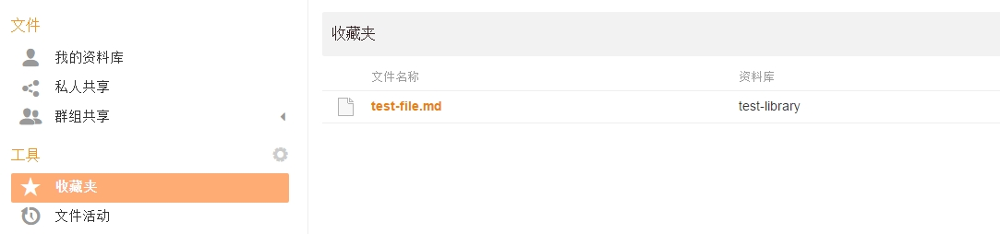

## 文件活动

点击左边功能导航栏“文件活动”可查看资料库、目录、文件的创建、修改、删除等历史。

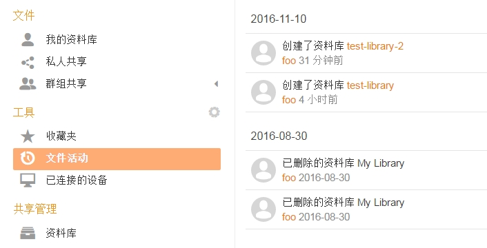