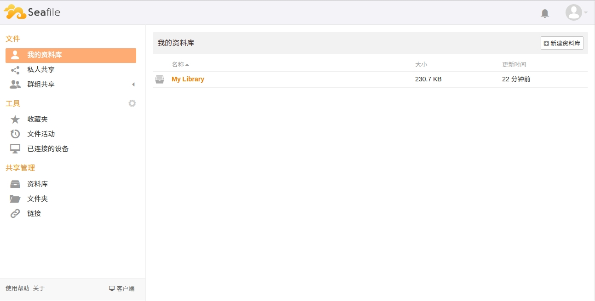
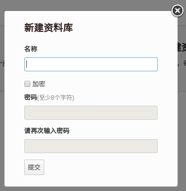
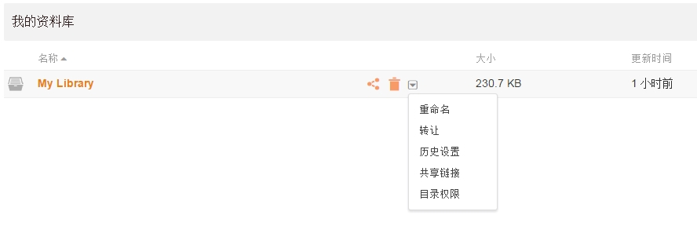
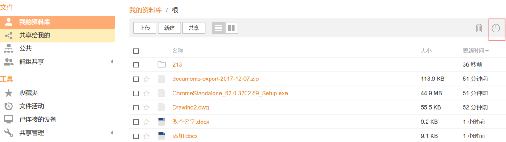
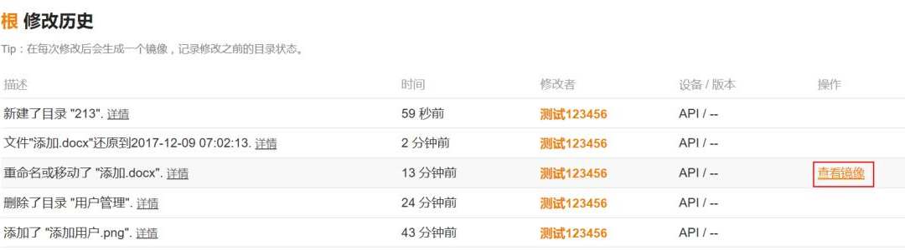
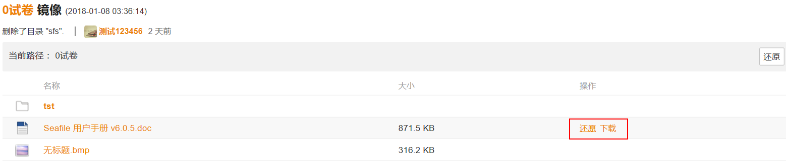

# 资料库管理

Seafile 通过“资料库”管理您的文件。资料库作为顶级容器用于存放文件和文件夹。你可以为每个工作项目或者每个文档类型创建一个资料库。资料库相当于一个顶级文件夹。但是它有如下一些特殊属性：

* 每个资料库保存自己的修改历史，但是没有针对所有资料库的全局文件修改历史。
* 每个资料库可以单独同步到桌面客户端，你可以选择同步哪些资料库。

当你登录 Seafile 网页界面之后，可以看到左边是功能导航栏(“文件活动”为专业版功能)，右边是资料库列表页面。用户可以在私人间或群组中共享这些资料库，每个资料库都可以选择性的在多台设备上同步，方便随时查阅。

## 新建资料库

点击页面上的 “新建资料库”按钮，可以新建资料库。新建资料库时，还可以将资料库“加密”，加强数据安全。

## 资料库操作

资料库列表中,每个资料库条目的右侧都有操作按钮,可以对资料库进行“共享”、“删除”、“重命名”、“转让”、“历史设置”、“共享链接”、“目录权限(专业版功能)”等操作。

## 资料库历史和快照

Seafile 还能记录整个资料库的修改历史。每当文件操作应用于资料库(文件更新、文件删除等)时，Seafile 就会创建资料库的前一状态的“快照”。快照包含资料库完整的文件和文件夹结构。在某些情况下，您已经更改了资料库中的许多文件，并发现您希望还原所有这些更改。此时,使用快照功能会非常方便。您可以将整个资料库恢复到过去快照状态的任何一点。它就像资料库的“时光机”。

查看资料库历史和快照的方法如下:

* 在 Seafile 网页界面，进入资料库根目录，点击“历史”图标，将出现一个列表, 列表将显示资料库所有的修改记录。

* 点击任意一个修改记录的“查看镜像”选项,将进入快照视图,你可以看到资料库在这一时间点的状态。

* 在快照视图下,你可以下载或者还原任意一个文件或者文件夹。如果你是资料库的所有者,你可以将资料库整体还原到这一时间点。

你可以通过资料库的“历史设置”来配置资料库历史的保留期限。