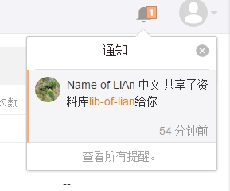
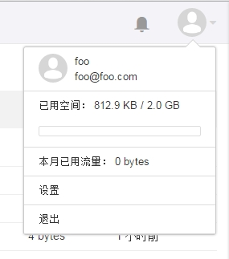
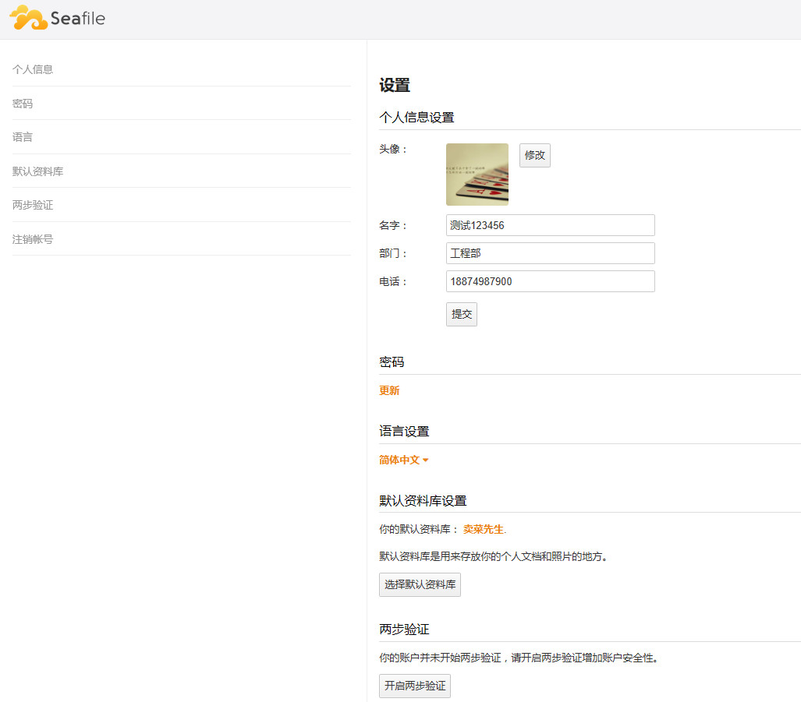
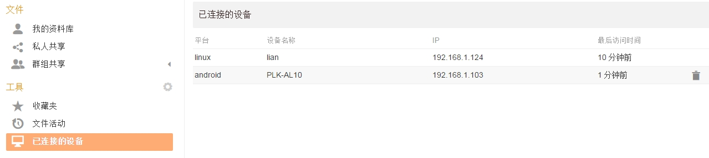

# 个人设置与管理

## 个人通知

点击右上角“通知”按钮可以查看个人通知。如果有其他用户共享资料库给你或上传文件到你共享的目录上传链接等,会在这里收到通知。

## 个人管理

点击右上角头像按钮,可以查看用户存储空间及共享流量等信息。

## 个人设置

点击上图中的“设置”按钮,进入个人设置页面,可以进行个人信息、密码修改, 更改语言,设置默认资料库和注销帐号等操作。

## 设备管理

点击左边功能导航栏“已连接的设备”可查看连接到 Seafile 服务器的设备列表。可通过右侧“删除”按钮,断开相应设备连接。

