# 共享与协作

## 共享给用户

选择某个资料库或者资料库下面某个文件夹,点击右侧“共享”按钮,选择“共享给用户”,输入希望共享的用户,设置他们对文件的权限,点击“提交“完成共享。

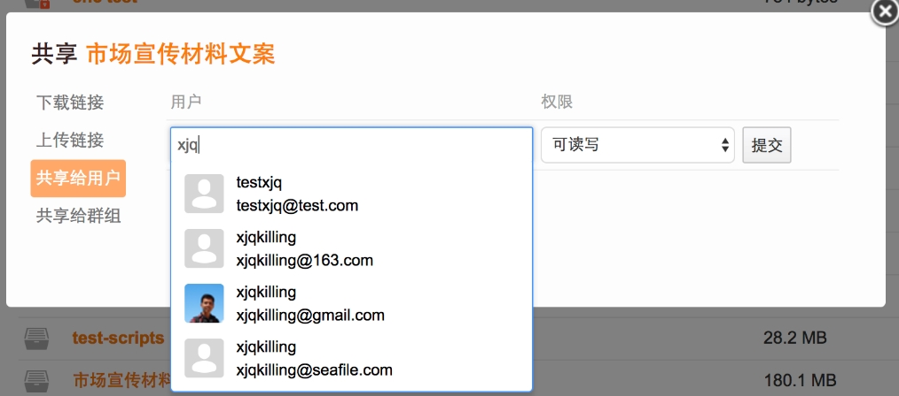

## 私人共享的资料库

点击左边功能导航栏“共享给我的”可查看别人共享给自己的资料库。点击资料库右侧“删除”图标,可以退出这个资料库的共享。

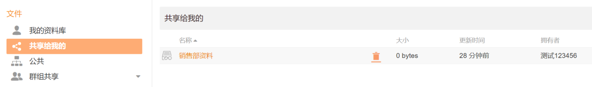

## 群组共享

点击左边功能导航栏“群组共享”可查看自己创建的群组和自己加入的群组,以及群组内的资料库。可以通过右上角“新建群组”按钮创建群组。

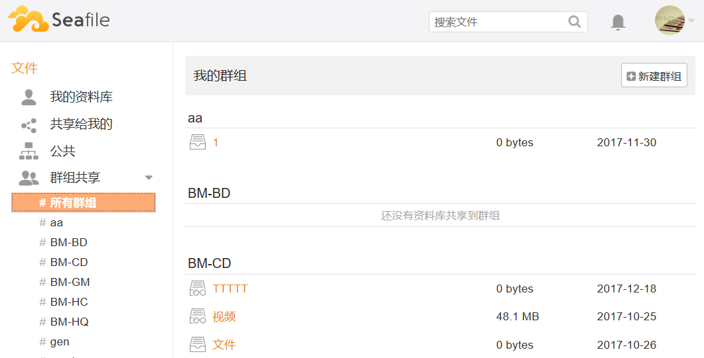

共享资料库或文件夹给群组的操作:选择某个资料库或者资料库里面某个文件夹,点击右侧“共享“按钮,选择“共享给群组”,选择一个群组并设置权限,点击“提交“完成共享。

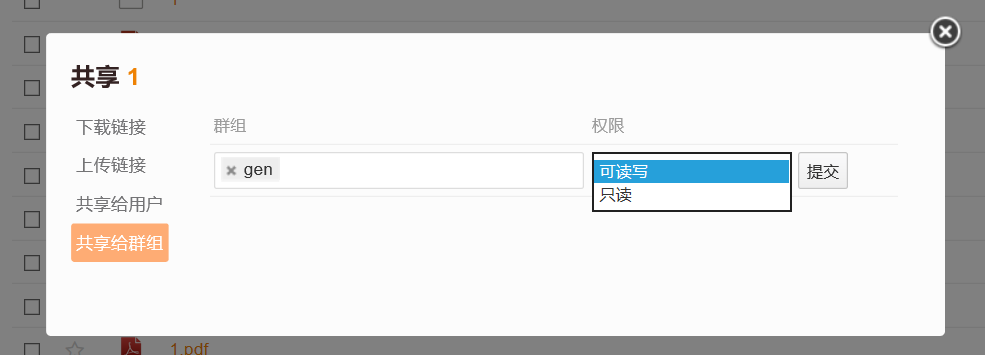

## 子目录访问权限设置

对共享出去的资料库或者目录,你可以针对某个用户或者群组,限定其对下面子目录的访问权限。目录权限只对共享出去的资料库或者目录有效。你首先需要将资料库或者目录共享给其他人,才能设定其他人对下面子目录的访问权限,否则设置的权限将不起作用。给一个资料库或目录设置的权限会自动被下面的子目录和文件继承。

以下是一个应用的场景:销售经理把一个资料库只读共享给了名为“销售部”的群组, 但是希望群组中的销售助理能修改名为“重要合同”的子目录下面的文件,此时可以单独给销售助理设置“可读写”权限。具体操作过程如下:销售经理将名为“销售部资料”的资料库分享给了群组“销售部”并且权限设置为“只读”,现在资料库旁边会有一个表示“只读”权限的小图标,进入该资料库后,用户不能执行任何修改操作。

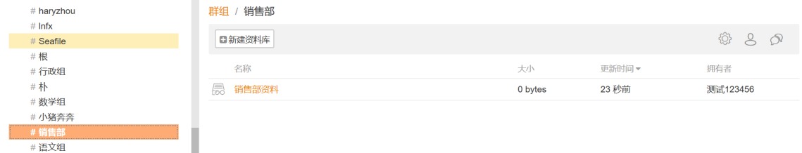

销售经理需要群组“销售部”的成员 James 临时协助编辑“重要合同”子目录下的一个文件,点击子目录右侧三角图标展开菜单,选择“权限”可以修改 James 的权限。

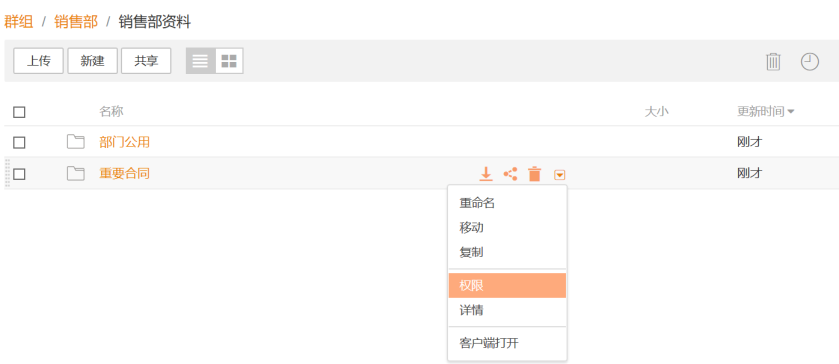

在权限设置中,选择把 James 的权限改为“可读写”,提交之后 James 可以对“重要合同”下的文件进行编辑。如果共享的资料库被同步到 PC 客户端,在 PC 上对只读的目录中文件的修改不会上传到服务器上。

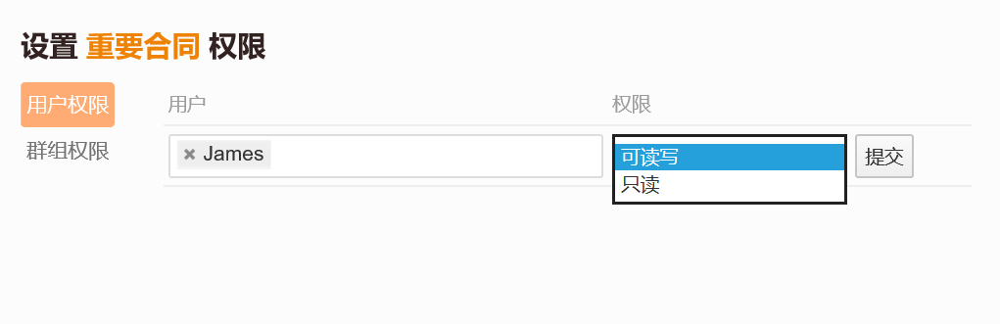

对多种权限之间的优先级关系说明如下:

1.  目录权限优先于共享的时候设置的权限。比如读写共享一个资料库给用户 A,同时设置了下面一个子目录的只读权限,那么 A 对这个子目录的访问权限为“只读”。
1.  针对特定用户设置的目录权限优先于对群组设置的目录权限。也就是说,当检查用户对某个目录的访问权限时,系统如果先匹配到一条针对用户设置的权限,就会忽略对用户所在群组设置的权限。
1.  子目录上的权限优先于父目录上的权限。

例子:假如有两级目录 A/B,用户 U 属于群组 G,针对用户 U 和目录 A 设置了“只读”权限,同时,针对群组 G 和目录 B 设置了“读写”权限。那么当用户 U 访问目录 B 的时候,得到的最终权限是“只读”。这是因为根据规则 2,系统会优先匹配针对用户设置的权限,由于 B 自动继承了 A 上的权限,所以 U 对 B 的访问权限也是只读。

## 文件锁定

当有多个人同时围绕一个文件工作的时候,经常出现多人同时修改一个文件的情况。Seafile 通过生成冲突文件的方式来处理这种情况。但是,很多时候更为便捷的工作方式是当一个人修改文件的时候,先对该文件进行锁定,保证其他人不能同时修改。 Seafile 企业版提供了文件锁定的功能。您可以通过 Web 客户端和 PC 客户端来使用文件锁定的功能。我们将逐一介绍。

## Web 客户端

当您在 Web 界面中浏览一个资料库的时候,您可以通过点击展开文件右侧的“倒三角”图标,点击“锁定”选项。

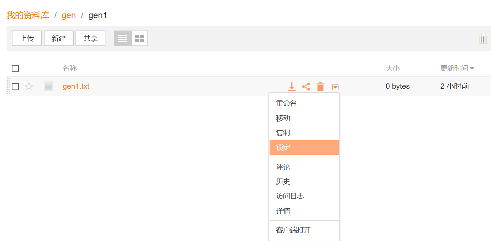

当文件被锁定之后,您可以看到在文件图标的右下角有一个红色的“停止”符号。当您把鼠标移动到这个符号上面时,可以看到是谁锁定了该文件。如果文件是由您锁定的, 您可以解锁该文件。但是您不能解锁别人锁定的文件。

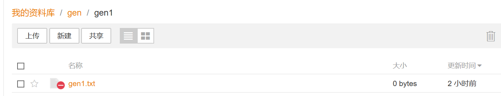

## PC 客户端

在一个资料库被同步到 PC 上之后,您可以直接在 Windows 文件管理器或者 Mac OS 的 Finder 里面直接锁定/解锁里面的文件。您可以通过文件右键菜单锁定一个已同步的文件。

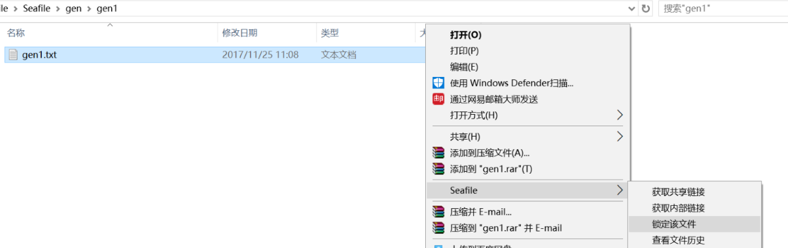

如果文件是由您本人锁定的,在文件左下角会显示一个橙色的“停止”符号。您可以通过右键菜单来解锁这个文件。

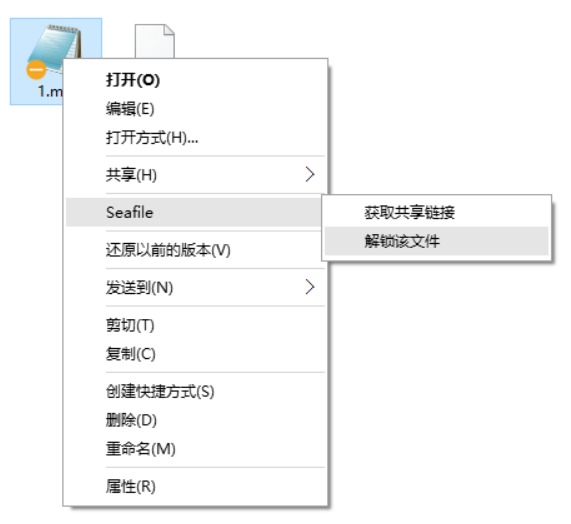

如果文件是由别人锁定的,文件右下角会显示一个红色的“停止”符号。该文件会自动变成只读状态,您不能修改它的内容。

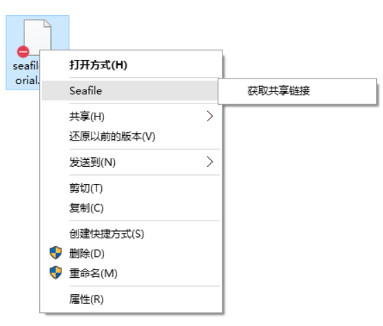

如果一个资料库还没有被同步,您也可以通过云端文件浏览器来锁定或者解锁里面的文件。关于文件锁定功能还有几点额外的信息需要补充:

1.  被锁定的文件只能由锁定者来解锁。
1.  当一个被锁定的文件被重命名或者在当前资料库内移动之后,它依然保持锁定状态。

## 资料库共享管理

点击左边功能导航栏“资料库”可查看自己共享给用户/群组的资料库,可以对相应资料库进行更改权限、取消共享等操作。

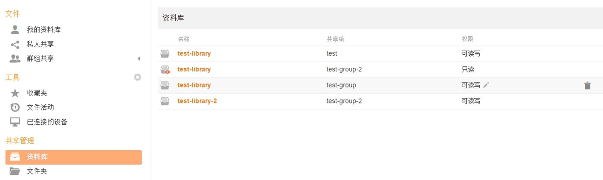

## 文件夹共享管理

点击左边功能导航栏“文件夹”可查看自己共享给用户/群组的资料库,可以对相应资料库进行更改权限、取消共享等操作。

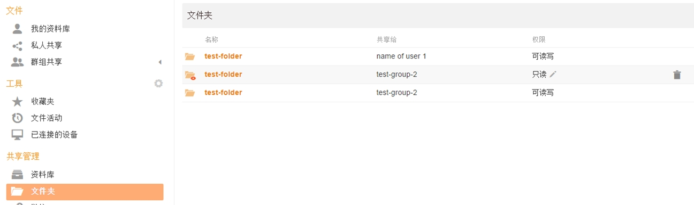

## 外链共享

共享外链是文件或文件夹的公共链接,任何人都可以访问它们,包括那些没有 Seafile 帐号的人。目前有两种类型的外链:

* 下载链接:为他人下载资料库、文件夹或者文件而创建。
* 上传链接:您可以使用上传链接收集他人的文件或者文件夹。您只能为资料库或者文件夹创建上传链接。其他人无法看到文件夹中的文件。他们只能将文件或者文件夹上传到链接。

点击资料库或者文件夹右侧的“共享“按钮,选择生成一个上传链接或者下载链接。如果是文件,则只支持生成下载链接。Seafile 支持为下载链接设置密码和过期时间,也可以设置“只可预览”。Seafile 对于上传链接也支持设置密码。

## 共享链接管理

点击左边功能导航栏“链接”可查看自己生成的共享链接,包含目录/文件的下载链接和目录的上传链接。可以查看、删除链接等。

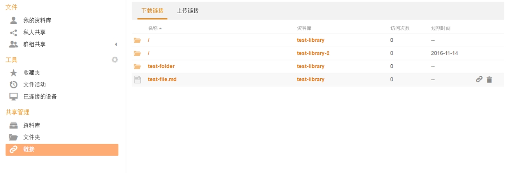