# 组织架构

专业版 6.3.0 之后，我们增加了一个全新的功能 -- 组织架构。相对于“群组”来说，该功能或许更适用于企业中的使用场景。
Seafile的组织架构功能是为了方便部门文件的分级管理而设计的，是对个人级别文件共享的一个重要补充。系统管理员可以导入或创建组织架构，并为每个部门预先创建部门资料库。不同于群组共享，部门资料库的所有权归部门所有，不与个人用户关联，不占用个人用户的存储空间。

## 部门管理

### 创建部门

组织架构中的部门可以通过两种方式创建。

系统管理员在系统管理界面按需创建各部门，并添加该部门成员和指定该部门的部门管理员：
系统管理员可以在 “系统管理” -> “组织架构” 页面中创建出顶级部门。

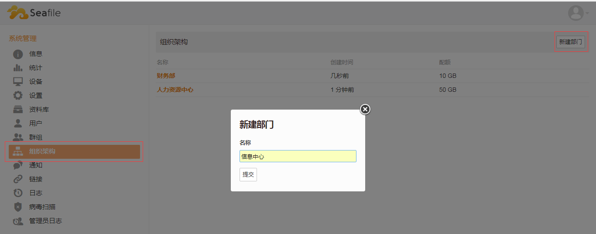

系统管理员可以在 “系统管理” -> “组织架构” 页面中管理系统中的所有部门。

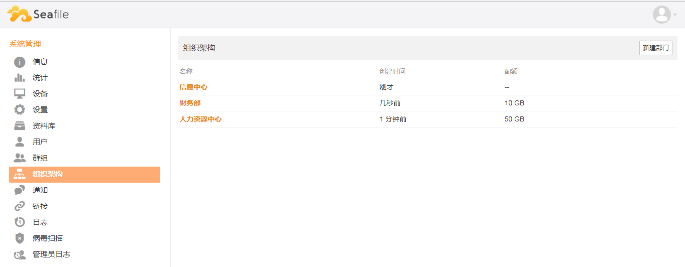

而且在每级部门下还可以有多级子部门存在，点击部门名称即可进入指定部门的管理界面，创建所需子部门。

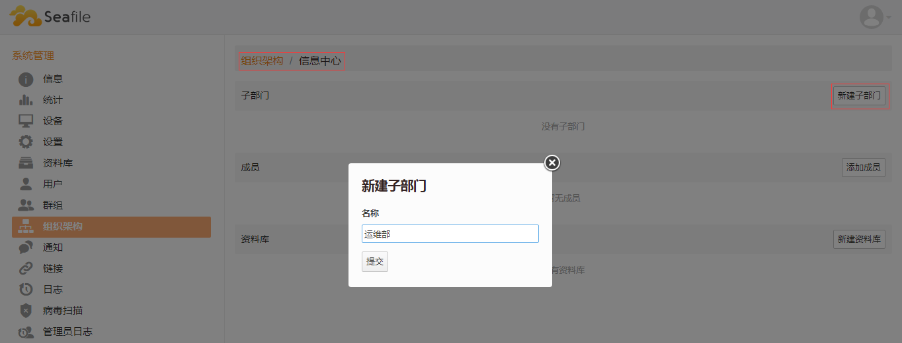

除了管理员在WEB端手动创建所需的各部门之外，还可以从 AD 或者其他途径导入企业中的组织架构：
根据 AD 中的部门结构关系，自动创建出所有部门，每个 OU (Organization Unit)对应一个部门，导入部门时还会自动为每个部门创建一个默认的资料库。
如何从 AD 导入组织架构请参考[同步AD群组](https://manual-cn.seafile.com/deploy_pro/ldap_group_sync.html)中的“同步OU为Seafile组织架构(6.3.0及其以上版本)”。

### 设置部门配额

系统管理员可在系统管理界面设置各部门的空间配额：
默认的部门空间配额为无限，系统管理员可按需配置，鼠标移动到指定部门条目上，即可出现一个“铅笔”图标，点击该图标可编辑配额大小。

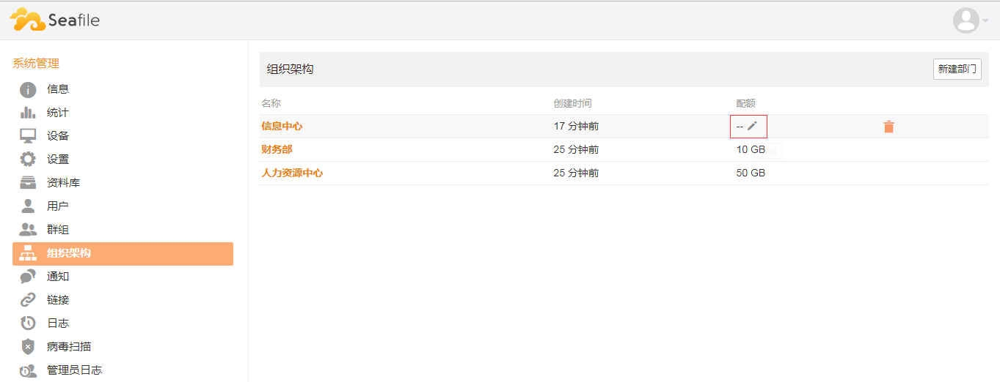

**注意**：各级部门之间的空间配额没有关联关系，子部门空间大小不受限于其上级部门的空间限制，即子部门空间配额可以超过上级部门空间配额大小。

## 使用部门群组

### 部门成员

系统管理员创建好组织架构之后，部门成员登录个人的账号之后，可以在左边栏的“群组”栏目中看到自己所属的部门以及所在部门的上级部门。点进去一个部门对应的群组之后，会看到群组名称旁边有个特殊的大厦图标，表示这个群组对应一个部门，以区别于一般的群组。

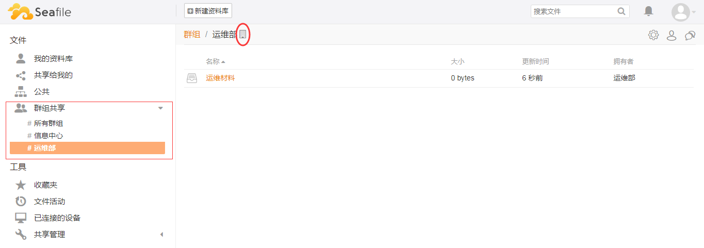

## 管理部门成员

### 添加/删除部门成员

系统管理员可在系统管理界面进入到指定部门，添加/删除该部门成员。

添加部门成员：
进入一个部门管理界面中，点击“添加成员”，在添加成员的界面中的搜索框中输入指定成员账号，搜索成功后点击“提交”按钮即可将该用户加入该部门中。

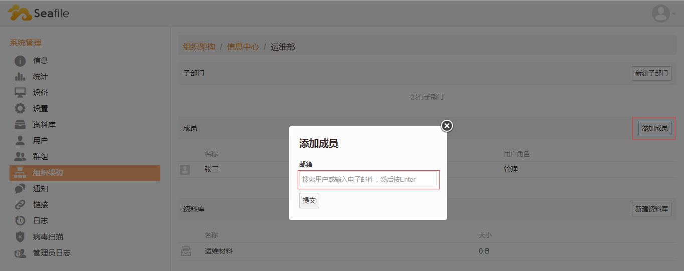

删除部门成员：
鼠标移动到指定成员条目上，该条目末尾会显示一个“垃圾桶”的标志，点击该标志，即可从该部门中删除该成员。

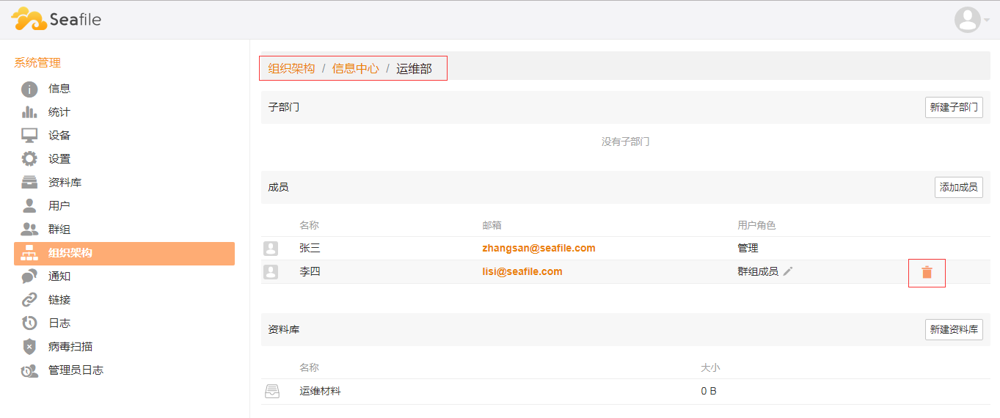

或者，各部门的部门管理员也可以进入各自所在部门，添加/删除该部门成员。

点击右上角“设置”按钮，“管理成员”：

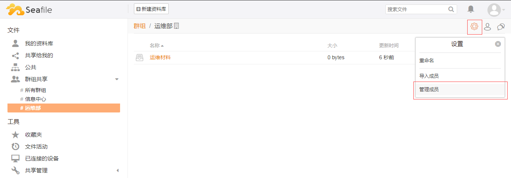

添加部门成员：
在搜索框中输入一个系统中已存在，但本部门中不存在的用户；搜索成功后点击“添加”按钮即可将该用户加入到本部门中。

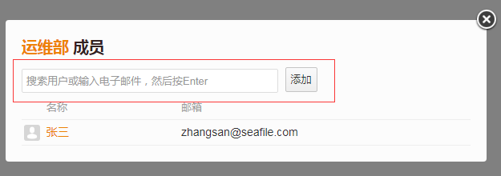

删除部门成员：
“管理成员”界面中，搜索框下方是该部门的成员列表，点击指定成员条目后的“叉号”即可从本部门中删除该成员。

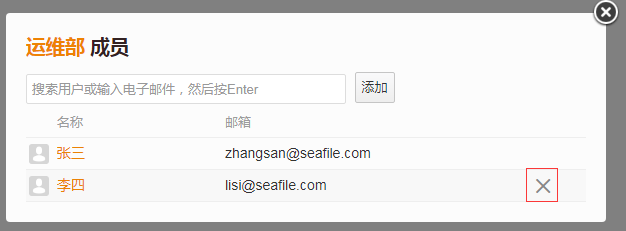

另外，从 AD 或者其他途径导入组织架构时，也会自动同步 AD 中的部门成员到 Seafile 中的所属部门下：

如何从 AD 导入组织架构请参考[同步AD群组](https://manual-cn.seafile.com/deploy_pro/ldap_group_sync.html)中的“同步OU为Seafile组织架构(6.3.0及其以上版本)”。

**注意**：使用 AD 同步的情况下，不建议管理员在部门管理界面手动添加/删除部门成员，因为下次 AD 同步时间到来时会自动覆盖手动操作。

### 设置部门成员角色

系统管理员在系统管理界面进入到指定部门，设置该部门下的各成员角色(普通成员/管理)：

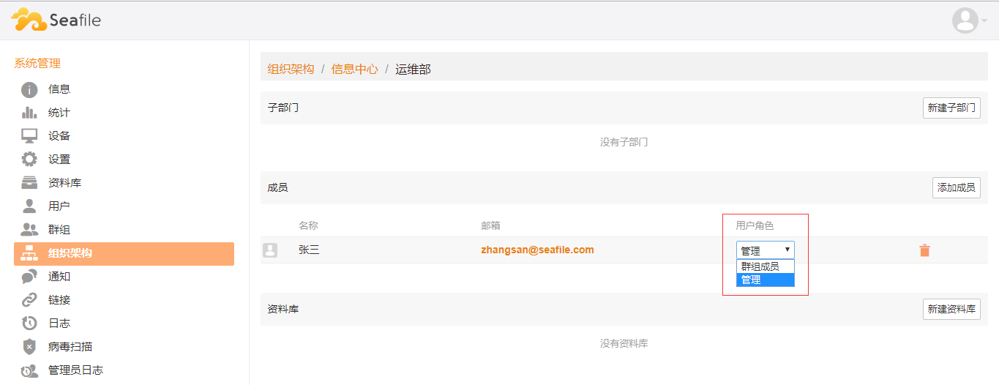

## 管理部门资料库

### 创建/删除部门资料库

系统管理员可在系统管理界面进入到指定部门，创建/删除部门资料库。

创建部门资料库：
资料库列表中，点击新建资料库，输入资料库名称点击提交即可创建出该资料库。

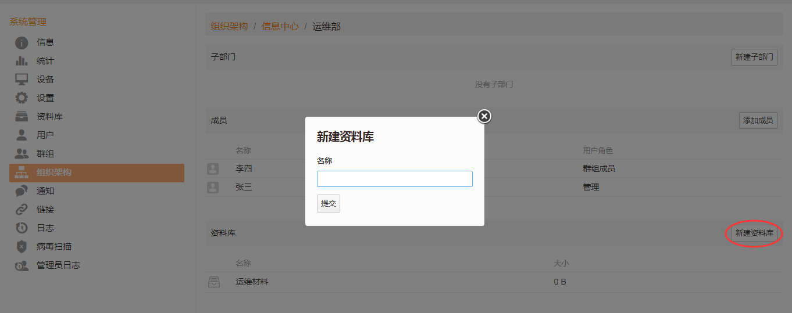

删除部门资料库：
资料库列表中，鼠标移动到指定资料库条目上，该条目末尾会显示一个“垃圾桶”标志，点击该标志，即可删除该资料库。

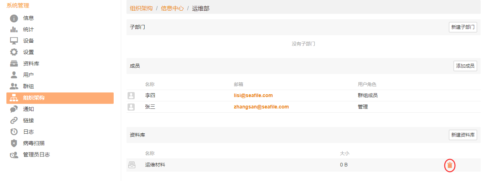

此外，各部门管理员还可以在本部门中创建/删除/重命名部门资料库。

创建部门资料库：
进入所在部门群组，点击部门名称上方“新建资料库”，输入资料名称，点击“提交”即可创建该资料库。

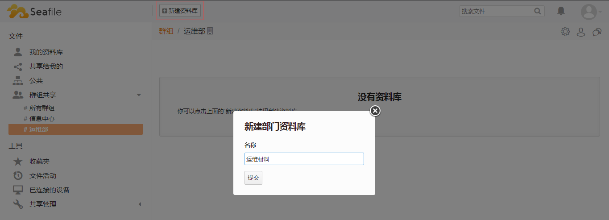

删除部门资料库：
资料库列表中，鼠标移动到指定资料库条目上，该条目末尾会显示一个“垃圾桶”标志，点击该标志，即可删除该资料库。

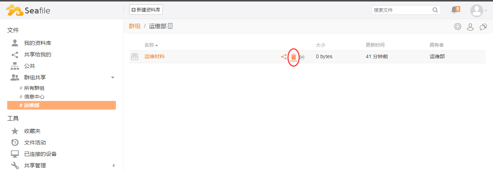

重命名部门资料库：
资料库列表中，鼠标移动到指定资料库条目上，该条目末尾会显示隐藏菜单栏，点击“倒三角”标志，点击“重命名”。

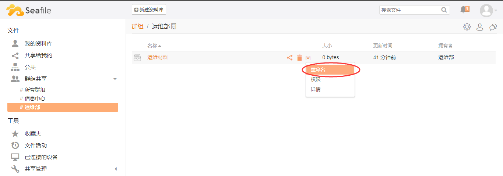

部门管理员还可以把部门资料库共享给部门外的人或者群组，其用法跟普通的群组共享完全相同。

**注意**：普通部门成员不可以创建/删除部门资料库，也不允许将个人的文件夹共享到部门，只能使用管理员创建的资料库。

### 资料库权限设置

部门管理员还可以调整部门资料库各级子目录的访问权限 (包括单独给部门中的一个人，或者部门中的一个子部门设置特殊权限)，比如设置为只读。

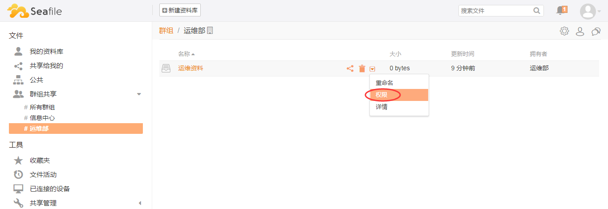