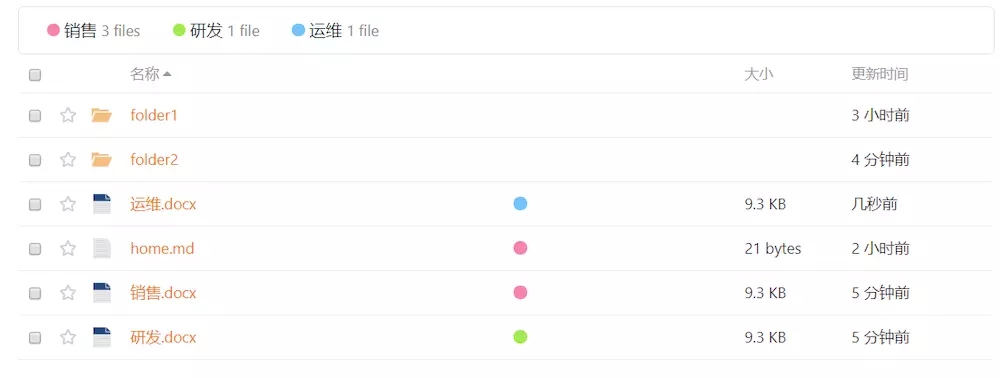

# 文件标签

在 Seafile 7.0 中，资料库增加了文件标签的功能，它可以帮助管理资料库的文件。你可以为一个共享资料库创建若干个标签，并为资料库中的文件添加不同的标签。在资料库的根目录中，你可以查看到这些标签，并快速访问到已经拥有标签的文件。

需要注意的是，文件标签旨在帮助团队管理资料库中的共享文件，所以是以资料库为范围进行管理，并不适用于管理私人的文件，因此没有提供全局支持跨资料库的标签。

