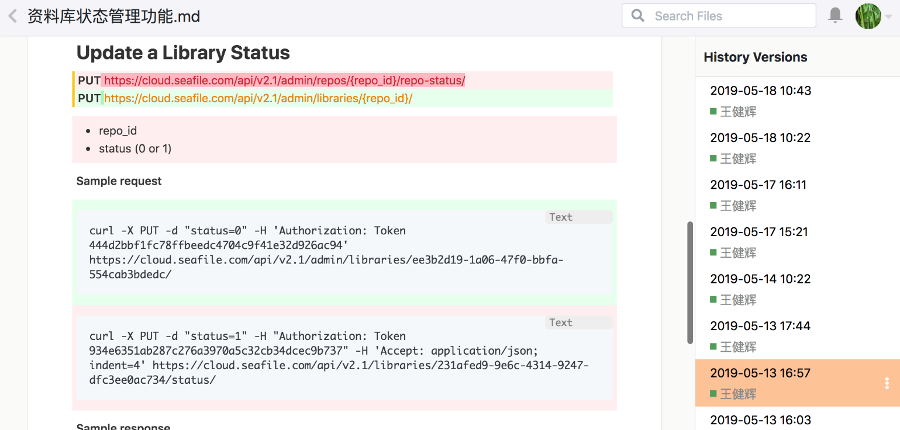

# Markdown 编辑器

Markdown 是一种简单易用的标记语法，它可以使普通文本内容具有一定的格式，在软件文档中被广泛采用。Seafile Markdown 编辑器支持在浏览器里面以所见即所得的方式编辑 Markdown 文件，具有以下特点：

 * 像编辑 word 文件一样编辑 Markdown 文件，简单直观。
 * 轻松插入图片、表格、链接、列表。
 * 图片插入: 你可以直接在文档中上传一个图片，还可以调整图片的显示大小，图片会作为一个文件保存在 Seafile 里面。你也可以通过 Ctrl-V 来黏贴一个图片截图。
 * 表格编辑: 支持增删行和列，支持连续单元格的复制和拷贝。
 * 文件历史和 Diff
 * 文档格式改进建议

在下面的章节中，我们将对Markdown编辑器的特色功能进行逐一介绍。

## 插入图片和文件

Seafile Markdown编辑器支持快速插入图片和文件，对于图片提供了3种插入模式：

 * 插入网络图片：提供一个网络链接来插入图片
 * 插入资料库图片：从Seafile已有资料库中选择插入图片
 * 上传本地图片：从本地目录上传图片，图片会作为一个文件保存在Seafile中

除了可以插入图片，您还可以将资料库中的文件作为一个链接插入，当点击这个链接时可以很方便地跳转到该文件进行查看。

## 文件历史和Diff

当多人在线协作同一个文档时，我们需要知道其他人对文档做了哪些修改。Markdown文档的历史将自动写入到数据库中，使用户可以快速访问文件的历史版本。

Markdown文档支持Diff的功能，可以对修改前后两个版本的内容进行比较。在浏览历史版本时，有修改的地方将会用红色和绿色字体突出显示。

## 文档格式改进建议

在我们编辑 Markdown 文档时不可避免地会出现一些格式问题，如果没有提示自己也很难发现，就会影响文档的规范性。为了帮用户更好地规范 Markdown 文档，Seafile Markdown编辑器会自动检查文档格式，并对常见的格式问题进行自动提示。目前支持的内容包括：

 * 缺少某一级标题
 * 标题以冒号结尾
 * 标题层级不连贯

打开 Markdown 文档右侧隐藏栏并点击中间蓝框中的按钮，就可以查看编辑器自动给出的修改提示。
