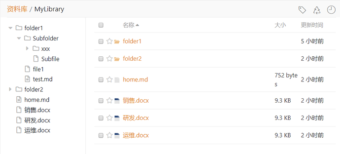
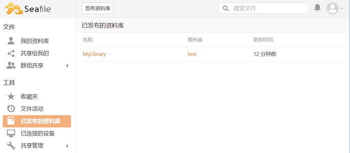

# 维基功能

维基功能主要有两种用途，第一是用于组织企业内部的文件，第二是用于对外发布。

对于第一种用途，从 Seafile 7.0 开始资料库支持分栏模式，用户不需要再单独创建维基，当创建完资料库之后，就能直接以维基的方式查看其中的内容。

对于第二种用途，从 Seafile 7.0 开始增加了公开发布资料库的功能。

## 分栏模式

在分栏模式中，资料库的界面将分为左右两栏，其中左侧栏显示的是树状查看模式，方便用户查看资料库的目录结构。右侧则是正常显示资料库的文件。

在界面左侧栏，资料库以维基的方式来展示目录结构,这对于管理文件夹层次很多的目录非常有用，您可以通过单击左侧树状视图中的文件轻松跳转到目标文件，而不需要逐级进入文件夹中查找文件。

## 公开发布资料库

如果希望文档公开，可以选择发布资料库。发布成功后，任何人都可以通过该资料库的 url 访问到其中的文件。已发布的资料库将显示在工具栏的“已发布资料库”中。

